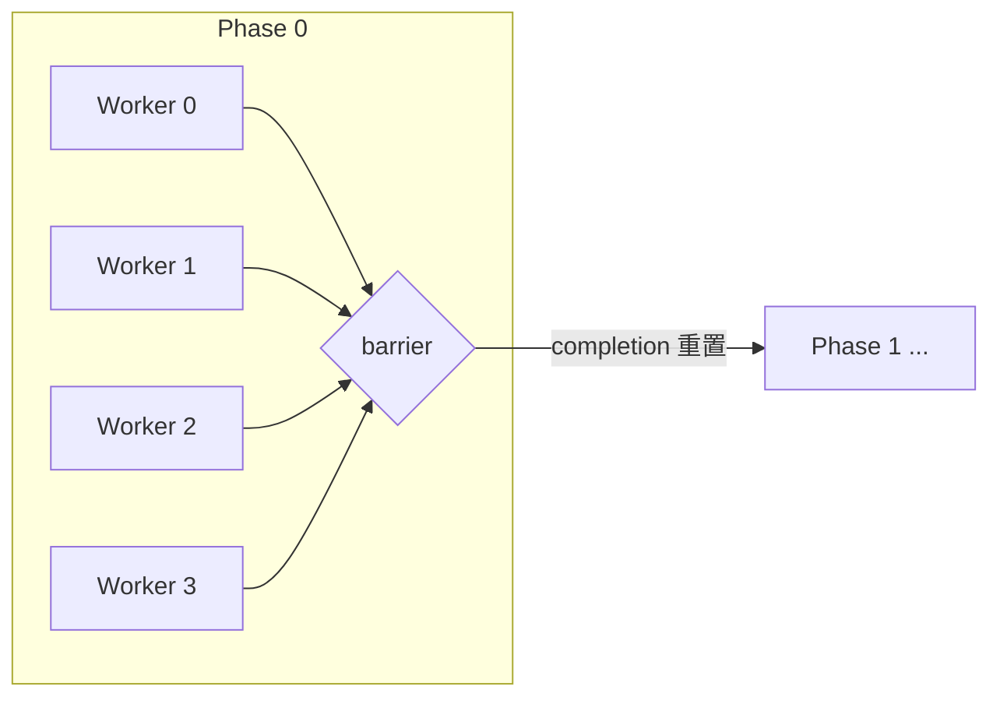
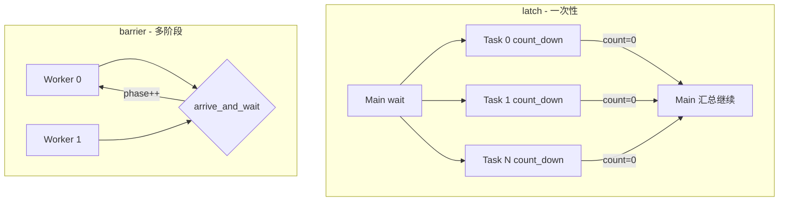

## `std::barrier` 是什么？

`std::barrier`（C++20）是**固定数量线程的阶段同步点**：某一阶段里，必须凑齐 `expected` 个参与者全部“到达”，这一 phase 才算结束，大家才能一起进入下一阶段。

可以把它理解成**可重复使用的“全员集合点”**：



---

## 与相关原语的对比

| 原语                 | 特点                   | 适用场景                      |
| -------------------- | ---------------------- | ----------------------------- |
| `std::barrier`       | 多阶段、可重置         | 仿真时间步、多 pass 并行计算  |
| `std::latch`         | 一次性倒数             | “等 N 个任务完成”后主线程继续 |
| `condition_variable` | 任意条件 + 手写 notify | 生产者/消费者、条件不确定     |
| `join()`             | 线程生命周期结束       | 任务跑完就退出，不是阶段同步  |

---

## 核心 API

```cpp
std::barrier sync(expected_count, completion_fn);

sync.arrive();           // 报到，可能不阻塞
sync.wait();             // 等本阶段结束
sync.arrive_and_wait();  // 最常用：报到 + 等待
sync.arrive_and_drop();  // 报到后退出后续阶段（expected 减 1）
```

**completion 函数**：本阶段**最后一个到达的线程**调用一次。

- 返回 `std::barrier<>::max()` → 用相同人数重置，进入下一阶段
- 返回更小的值 → 下一阶段参与者变少
- 返回 `void` → barrier 不再重置（相当于一次性）

---

## 最佳实践要点

1. **expected 必须等于实际参与每个阶段的线程数**（动态缩容用 `arrive_and_drop()`）。
2. **多阶段循环里用 `arrive_and_wait()`**，比分开写 `arrive()` + `wait()` 更不易出错。
3. **completion 里只做轻量工作**（记 phase、打日志）；重逻辑放在 barrier 之外。
4. **阶段间共享数据**：本阶段写、下一阶段读时，barrier 提供同步；阶段内仍可能需要 mutex。
5. **固定线程池 + 重复 phase** 用 barrier；**一次性等待** 用 `std::latch` 更简单。

---

## 项目中的示例

已在 `synchronization.cpp` 中加入 `testBarrier()`，演示 4 个 worker、3 个 phase 的并行累加：

```165:218:d:\repos\engines\ZeusEngine\bestPractice\cpp\multiThread\synchronization.cpp
/*
std::barrier (C++20): 固定数量线程的“阶段同步点”。
...
*/
void testBarrier() {
    PRINT_FUNC_NAME();
    // ...
    std::barrier sync(kNumWorkers, on_phase_done);
    // 每个 phase 末尾：
    sync.arrive_and_wait();
}
```

运行时在 `main.cpp` 里取消注释即可：

```cpp
synchronization::testBarrier();
```

预期输出类似：各 worker 在不同时间完成本 phase → 打印 `barrier phase N complete` → 进入下一 phase → 最后输出 `barrier final total=60`。

---

## 典型使用模式（伪代码）

```cpp
// 并行仿真：每帧所有 worker 算完再交换/渲染
std::barrier frame_sync(num_workers, []() noexcept {
    return std::barrier<>::max();  // 下一帧继续
});

for (auto &worker : pool) {
    worker = std::thread([&] {
        while (running) {
            simulate_one_step();   // 本 worker 的本帧工作
            frame_sync.arrive_and_wait();  // 等所有 worker 本帧完成
        }
    });
}
```

**不要用 barrier 替代**：生产者/消费者队列（用 `condition_variable`）、一次性启动同步（用 `latch`）、线程退出等待（用 `join()`）。

如需补充 `arrive_and_drop()` 或 `barrier` vs `latch` 的对照示例，可以继续加到同一模块里。


## `std::latch` 是什么？

`std::latch`（C++20）是**一次性倒数同步器**：构造时设定 `expected`，每完成一件事就 `count_down()` 一次，计数减到 0 时，所有在 `wait()` 上的线程被唤醒。用于主线程等子任务，**单向**“等 N 个完成”。

和 `barrier` 的核心区别：

|          | `std::latch`          | `std::barrier`        |
| -------- | --------------------- | --------------------- |
| 可重用   | 否，减到 0 即结束     | 是，completion 可重置 |
| 典型角色 | 一方等待 N 个事件完成 | N 方互相等多阶段到齐  |
| 场景     | 单阶段 fork-join      | 多 phase 循环         |

---

## 核心 API

```cpp
std::latch done(n);     // 等待 n 次 count_down

done.count_down();      // 减 1（常用）
done.count_down(k);     // 一次减 k
done.wait();            // 阻塞直到计数为 0
done.try_wait();        // 非阻塞检查
done.is_ready();        // 是否已为 0
```

---

## 最佳实践要点

1. **一次性的 fork-join**：主线程 `wait()`，子任务完成后 `count_down()`，比 `mutex + condition_variable + 计数` 更简洁。
2. **expected 必须等于会调用 `count_down` 的次数**（可用 `count_down(k)` 一次减多个）。
3. **减到 0 后不可复用**；多阶段循环用 `std::barrier`。
4. **`wait()` 返回后再 `join()` 子线程**；不要在 `wait()` 前 `detach()`，否则结果数组可能还在写。
5. **双 latch 启动门控**（进阶）：一个 `ready` 等全员就绪，一个 `start` 由主线程 `count_down` 放行——适合“全部初始化完再同时开跑”。

---

## 项目中的示例

已在 `synchronization.cpp` 加入 `testLatch()`，演示**主线程等待 4 个并行任务全部完成再汇总**：

```225:264:d:\repos\engines\ZeusEngine\bestPractice\cpp\multiThread\synchronization.cpp
void testLatch() {
    PRINT_FUNC_NAME();

    constexpr int kNumTasks = 4;
    std::latch all_done(kNumTasks);
    std::vector<int> results(kNumTasks, 0);
    // ... 各 task 完成后 all_done.count_down()
    all_done.wait();   // 主线程在此等待
    // 汇总 results，再 join
}
```

在 `main.cpp` 取消注释即可运行：

```cpp
synchronization::testLatch();
```

预期输出：各 task 按不同耗时完成 → `latch all tasks done, sum=100`（10+20+30+40）。

---

## 与 barrier 示例的对照



- **latch：主线程等子任务，单向“等 N 个完成”。**
- **barrier：worker 之间互相等，可重复多个 phase。**

若需要，我可以再补一个**双 latch 启动门控**（ready + start）示例。