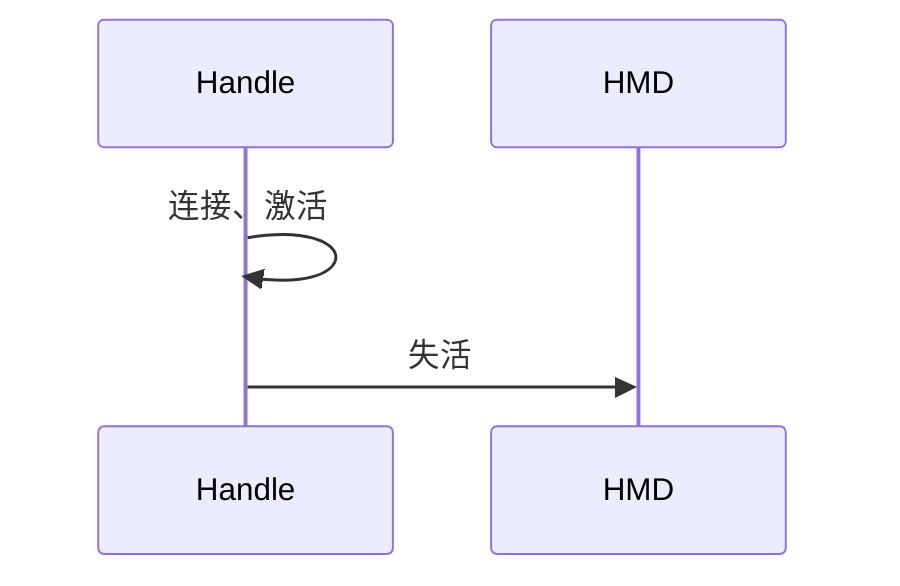

### 工作计划

1. 完成事件重构：设备管理重构：设备切换、交互方式切换
2. 完成眼手近场交互

### **设备管理重构**

1. 现状：
   - 手柄、眼手、头控 交互方式切换业务逻辑：
     - 当有手柄连接时，使用手柄交互；
     - 当手柄断开连接时，我们需要主动开启眼动和手势服务，使用眼手交互；
     - 当无眼动服务，只有手势服务时，使用手势交互；
     - 当以上都没有时，使用头控；
2. 设备状态管理
   - 设备状态：断开、连接、激活、失活、丢失；
   - 设备优先级：手柄>眼手=手势>ＨＭＤ
     - 高优先级设备连接、激活时，失活所有低优先级设备；该部分逻辑系统 or 业务负责？
     - 高优先级设备断开、失活时，激活所有低优先级设备？ or 激活次优先级设备？ 谁维护设备优先级列表；
     - 

   - 设备切换\交互方式切换
     - 不存在显式的交互方式切换，交互方式的切换依赖于设备的激活状态

   - 

3. 重构方案：
   - 眼动设备被激活时，启动眼动服务，启动失败则直接失活；
   - 手势设备被激活时，启动手势服务，启动失败则直接失活；
   - 

### 眼手近场交互

1. 方案：
2. 问题：
   - 单双手交互事件切换，左->双->右；
   - 事件的Cancel是否需要新增轴事件；
   - 近远场切换：
     - cursor效果使用近场

   - 近场Poke及Pinch都需支持

3. 

双圆锥优化

1. 细圆锥是否继续保留？
2. 物理引擎只有stay保证正确，只能每帧重新检测，填充检测结果列表
3. 轨迹绘制组件；
4. 眼动裸数据录制；
5. 测试场景共同构建；
6. 目前实现方案存在的问题；
   - 模拟测试中，3D board场景，纯圆锥检测，偶现检测到后方board

基础事件参数问题讨论：

1. 基础事件：hover\click\press\long press\hold\translate\scroll\scale的触发时机、各个阶段分别携带哪些参数；

2. Hold事件不再取消，hold事件参数begin\update\end时携带begin的检测结果，colliderResult的world position(手柄拉长board重新解算、眼手做mapping)用于表征cursor位置；

3. 各事件检测结果是否实时更新： 是否仅hover事件、press、longPress事件的colliderResult实时更新，其余需要update的事件，colliderResult的collider均保持与begin一致；

4. 出检测范围之后，替换ColliderResult；

   - Hover、Drag&Drop一直用实时检测结果；其余事件全部替换；
   - 增加是否位于初始交互对象标志位；

5. 

   