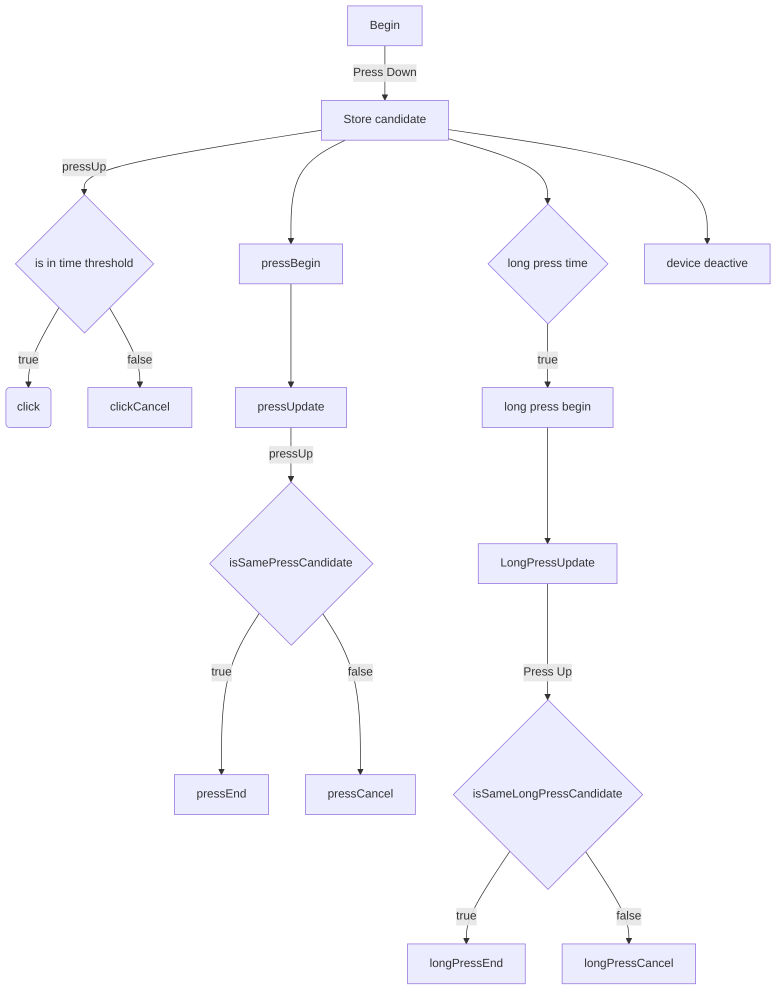
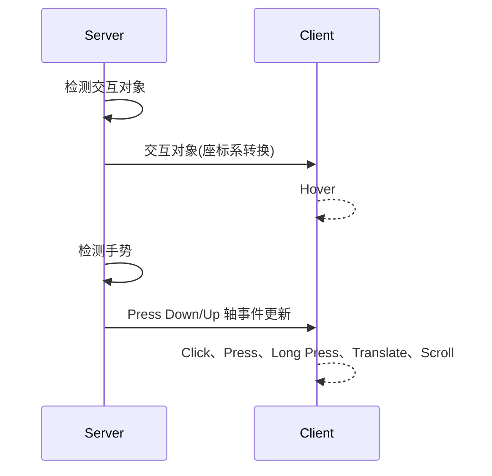
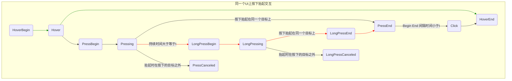

1. 眼手支持Drag&Drop
2. 搭建单元测试
3. 手柄事件分发移植
4. 设备切换梳理
5. 输入事件，检测，分发，Ui事件转译，内部的状态切换，逻辑关系图
   - server-client轴事件、检测结果分发
   - 事件处理梳理
     - Detector和Invoker架构、工作流程、优先级
       - 选择器优先级：
         - 四种不同检测器设备类型， 优先级：EYE>HAND=GESTURE>HMD
         - 近场远场交互优先级：近场>远场
         - 排列组合共有8种交互器类型，按优先级：眼动近场>眼动远场>手柄（手势）近场>手柄（手势）远场>HMD近场>HMD远场
     - 双设备交互
   - 事件互斥逻辑
     - 单设备事件互斥
       - translate事件cancel hover (其他事件也可以有同样需求)
       - translate事件cancel hover，影响slider效果实现
       - scroll事件cancel translate\hole\press\long press等事件
     - 多设备事件互斥
       - 一个交互对象在被多个设备hover期间，只触发第一个设备的hover事件；
       - 设备对交互对象press down期间，交互对象被独占，其他设备无法交互；
       - 多设备交互，例如 双手scale触发后，cancel交互对象已被触发的所有事件；
     - 事件屏蔽互斥：双手事件cancel单手事件，单手事件独占交互对象，hover事件共享交互对象；单设备触发事件：Scroll打断hold\translate\press\long press等，translate事件cancel hover事件；
   - 
6. 事件处理流程图

检测器优先级： 眼动近场>眼动远场>手柄（手势）近场>手柄（手势）远场>HMD近场>HMD远场

