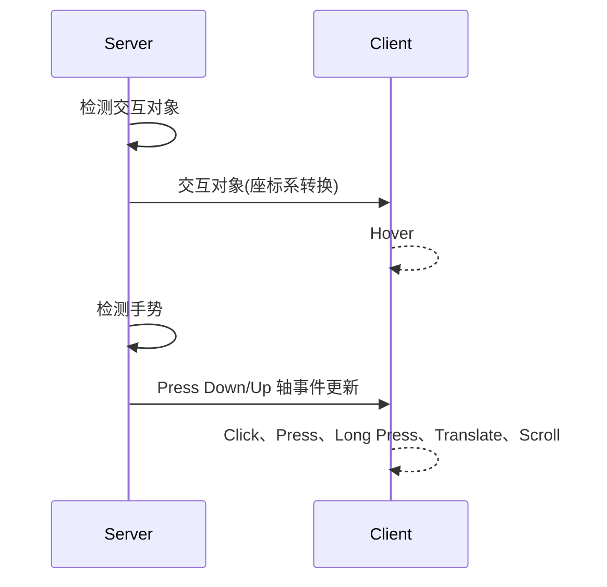
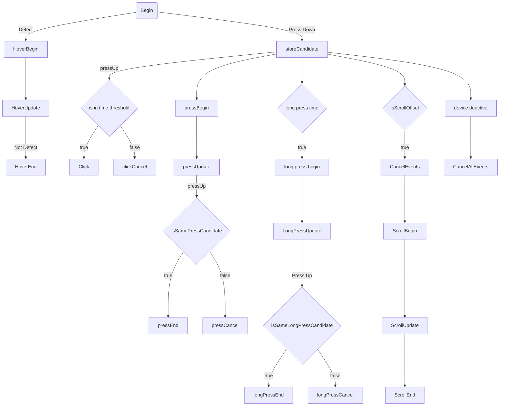

事件互斥逻辑梳理：

- 采用抢占式优先级调度策略，高优先级事件触发时，暂停低优先级事件；[有需要cancel 的情况吗？]

- 优先级：双设备事件（Zoom）>Scroll > 其他单设备事件（Press、Hold等）> Hover；

- 独占性：除Scroll、Hover之外，其余事件均独占交互对象；

- 高优先级事件触发时，Pause或Cancel正在update的低优先级事件，取决于高优先级事件是否是强占性的；

- cases:

  - 两个选择器Ａ、Ｂ先后Aim：Ａ触发Hover，B不触发；A离开后B触发Hover；
  - 选择器A Hover过程中，触发器B进行触发事件：Pause A的Hover事件；（2D UI 只能响应正在Hover设备的事件？）
  - 触发器A事件交互过程中（Event Updating），触发器B对同一对象触发单设备事件：触发器A独占，B不触发事件；
  - 触发器A事件交互过程中（Event Updating），触发器B对同一对象触发双设备事件：B触发B的单设备事件和双设备事件，双设备事件中断A和B的单设备事件；
  - 触发器交互的过程中，对象被释放，Cancel已触发事件；

- Click事件触发时机：与目前事件互斥实现矛盾；左手触发持续性事件时，右手能否触发瞬时性事件？

  - 左down,右down,左up,右up  |0.3s 触发右手click
  - 左down,右down,右up,左up  |0.3s 触发左手click
  - 左down,右down,左up  |0.3s  右up 触发左手click ? 
  - 左down,右down,右up  |0.3s  左up 触发右手click ?
  - 左down,右down, |0.3s  左up,右up  不触发click

- 

  

  


### 事件系统重构

事件相关内容单独拉一个模块（或模块集合），如叫 eventSystem，负责设备状态管理切换，交互状态管理切换，事件分发，裸事件转译为 UI 事件。每个部分可以继续细分小模块或类。（将Engine里的 inputDeviceManager 合并进来，Engine 通过 System Rendering 把 interactable 相关信息进行同步）。直接在 Server 端完成所有事件的处理，直接生成press 等事件传递给 client 。

1. 事件分发Server端/Client端职责划分

   - Server到Client端的普通事件指令发送是单向的；跨进程交互事件的指令发送是双向的，需要Client端向Server端返回数据；
   - Server端（EventCaster）
     - 交互对象检测（Detector）
     - 事件指令、事件参数生成并发送
       - 直接生成具体事件指令（PressBegin、HoldUpdate...），携带单一交互对象ID（检测结果中第一个），表达在指定交互对象上触发指定事件
       - 事件参数(Pose等信息需要座标系转换、设备信息)
       - 根据轴数据及Interactable各Handler回调绑定情况，决定生成对应的事件指令；**[Server端的Interactable被创建时，无Handler信息，事件的回调函数是在Client端的，用标志位解决？]**
     - 事件互斥
       - 事件互斥逻辑完全在Server端实现
         - 双手事件、单手事件、Hover事件的互斥逻辑不变
         - 单手事件的互斥逻辑（Scroll Cancel 其他单手事件），需要修改为Scroll Offset达到阈值后Cancel其他事件；
       - 其他Event Block逻辑
   - Client端（EventInvoker）
     - 接收事件指令，查找到对应交互对象，触发事件回调；
     - 在处理跨进程交互事件时（Drag&Drop），也需要向Server端发送Ack信息；

   ```mermaid
   sequenceDiagram
       ServerCaster->>ServerCaster: 记录交互对象、Press Down轴事件
       ServerCaster->>ClientInvoker: 事件指令(Hover、Click、Press、Long Press、Translate、Scroll、DragDrop)
       ClientInvoker->>ClientInvoker: 事件处理
       ServerCaster->>ServerCaster: 读取交互对象、Press Up轴事件
       ServerCaster->>ClientInvoker: 事件End指令
       ServerCaster->>ClientInvoker:DragStart
       ClientInvoker-->>ServerCaster: DragStart Ack
       ServerCaster->>ClientInvoker2:DropOver
       ClientInvoker2-->>ServerCaster:DropOver Ack
   	ServerCaster->>ClientInvoker2:Drop
       ClientInvoker2-->>ServerCaster:DropComple Ack
   ```

2. 设备管理模块

   - 事件系统设备管理：

     - Server端设备管理

       - 设备连接时，为对应设备创建EventCaster（处理单设备交互），创建全局EventCaster（处理多设备交互）
       - 设备断开时，事件系统Server端Cancel已触发事件；
       - 设备激活时，处理事件；
       - 设备失活时，Cancel已触发事件，不再处理事件；

     - Client端不需要设备状态管理，只需要为对应的设备创建EventInvoker；

       ```mermaid
       sequenceDiagram
           InputDeviceManager->>ServerCaster: Device Connect
           ServerCaster->>ServerCaster : Create Event Caster
       	InputDeviceManager->>ServerCaster: Device DisConnect
           ServerCaster->>ServerCaster : Delete Event Caster
           InputDeviceManager->>ServerCaster: Device Active
           ServerCaster->>ClientInvoker:Handle Events
           InputDeviceManager->>ServerCaster: Device DeActive
           ServerCaster->>ClientInvoker:Cancel Events
       ```

       

   - 设备切换逻辑梳理

     - 相关设备：HMD、手柄、眼手、鼠标、键盘；

     - 设备状态：连接、断开，激活、失活(input/pose/state idle:0 active:1 tracking:2)，设备的切换是指设备的激活、失活；

     - 虚拟设备状态及底层服务管理(output/pose/state start:1 resume:2 pause:3 stop:4)

       - 手势服务
       - 眼动服务

       ```mermaid
       sequenceDiagram
           Handler->>Eye:out/pose/state:resume/pause
           Eye->>Eye: 开启/关闭眼动服务
           Handler->>Gesture:out/pose/state:resume/pause
           Gesture->>Gesture:开启/关闭手势服务、模型 
           Eye->>HMD:眼手关闭
           HMD->>Eye:眼手打开
           Gesture->>HMD:眼手关闭（input/pose/state deactive）
           HMD->>Gesture:眼手打开（input/pose/state active）
           Handler->>HMD:手柄断开
           HMD->>Handler:手柄连接
       ```

       

     ```c++
     void VirtualDevice::onAxisUpdate(InputAxis& axis) {
         if (bool(m_virtualDevice->characteristics() & DeviceCharacteristics::GESTURE)) {
             // LOGI("jhy onAxis update Hander Track Start device name %s id %d axis %s value %d", axis.device().name(),
             //  axis.device().id(), axis.name(), (int)axis.value<int>());
             if (std::string(axis.name()).find("output/pose/state") != std::string::npos) {
                 if ((axis.value<int>() == 1)) {
                     LOGI("Hander Track Start");
                     // ihand::HandTracker::singleton()->init();
                 } else if ((axis.value<int>() == 2)) {
                     LOGI("Hander Track resume");
                     iris::compositor::GestureControllerManagerImpl::singleton()->setActive(true);
                     iris::compositor::GestureControllerManagerImpl::singleton()->setVisable(true);
                     m_virtualDevice->setActive(true);
                     updateDeviceState(2);
                 } else if ((axis.value<int>() == 3)) {
                     LOGI("Hander Track pause");
                     iris::compositor::GestureControllerManagerImpl::singleton()->setActive(false);
                     iris::compositor::GestureControllerManagerImpl::singleton()->setVisable(false);
                     m_virtualDevice->setActive(false);
                     updateDeviceState(0);
                 } else if ((axis.value<int>() == 4)) {
                     LOGI("Hander Track Stop");
                     // ihand::HandTracker::singleton()->exit();
                 }
             }
         }
         //眼动, 只跟新设备状态不更新 手势服务
         if (bool(m_virtualDevice->characteristics() & DeviceCharacteristics::EYE)) {
             if (std::string(axis.name()).find("output/pose/state") != std::string::npos) {
                 if ((axis.value<int>() == 1)) {
                     LOGI("EYE Track Start");
                 } else if ((axis.value<int>() == 2)) {
                     LOGI("EYE Track resume");
                     m_virtualDevice->setActive(true);
                     updateDeviceState(2);
                 } else if ((axis.value<int>() == 3)) {
                     LOGI("EYE Track pause");
                     m_virtualDevice->setActive(false);
                     updateDeviceState(0);
                 } else if ((axis.value<int>() == 4)) {
                     LOGI("EYE Track Stop");
                 }
             }
         }
     }
     ```

   - 设备管理模块

     - EventSystem中多个设备相关的业务逻辑接口，需要移出；
     - 业务层的设备管理模块负责设备所有业务逻辑：切换、模型配置、渲染等；

     

3. 存在的问题

   - 可行性问题：Server端Interactable无Handler信息，事件回调在client端；
     - 方案1:能否server端interactable的handler用标志位解决；
     - 方案2:只第一个交互对象需要发送，所有事件均发送；
   - Client 也需要向Server端发送指令（用于状态设置等），例如：drag&drop交互中，dragStart事件设置数据包允许的**操作类型**到Invoker交互状态；只在Client端存储**操作类型**无法解决跨进程drag&drop时的交互问题；如果需要client向Server端发送事件ACK携带**操作类型**，增加XR接口，目前该部分的开发较为麻烦；[建立IPC通道]
   - 分别属于多个window的交互对象PressDwon，只向一个交互对象所在的window发送事件？与模拟冒泡冲突；[只关心第一个交互对象，没有冒泡]

4. 优点：

   - 交互业务逻辑统一在Server端处理，结构更清晰，易于对事件交互逻辑进行维护；
   - 简化PressUp事件处理逻辑；未指向交互对象时，Press Up轴事件的处理：Server端记录响应过PressDown事件的交互对象，继续响应PressUp事件；（之前需要client端设置server端的externalCollider）

5. 实施方案

   - 新老事件系统同时存在，老事件系统中的业务逻辑向新事件系统逐步迁移（通过各事件逻辑开关控制），方便测试即时反馈问题；
   - 覆盖自动化单元测试，UISample自测；

6. 其他

   - 客户定制化需求
     - 设备切换\交互方式切换
     - 事件屏蔽定制
   - 其他积累问题一并处理：
     - 取消hold事件
     - 取消ScrollView模拟冒泡
     - [眼动设备注册优化](https://git.iris-view.com/graphics/docs/-/issues/1392)
     - 设备注册转到系统组

   