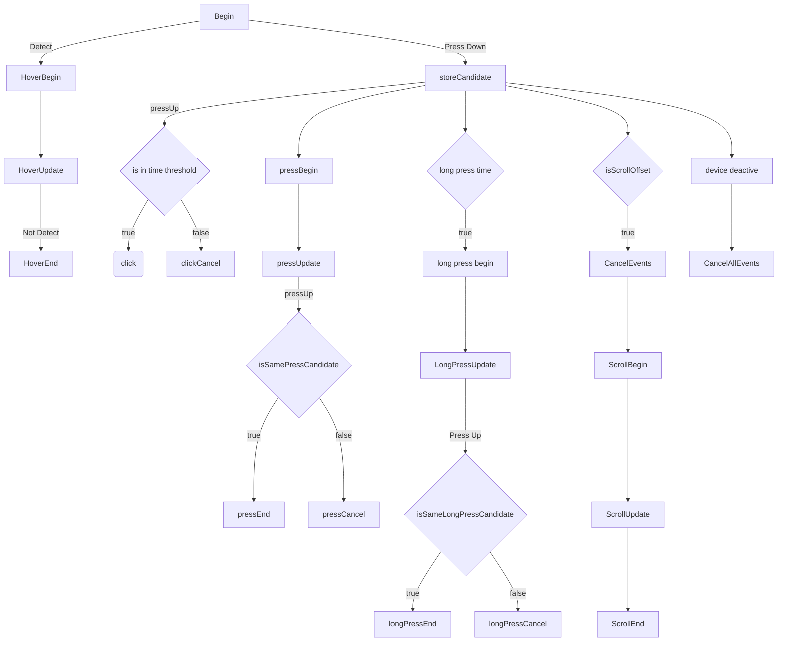
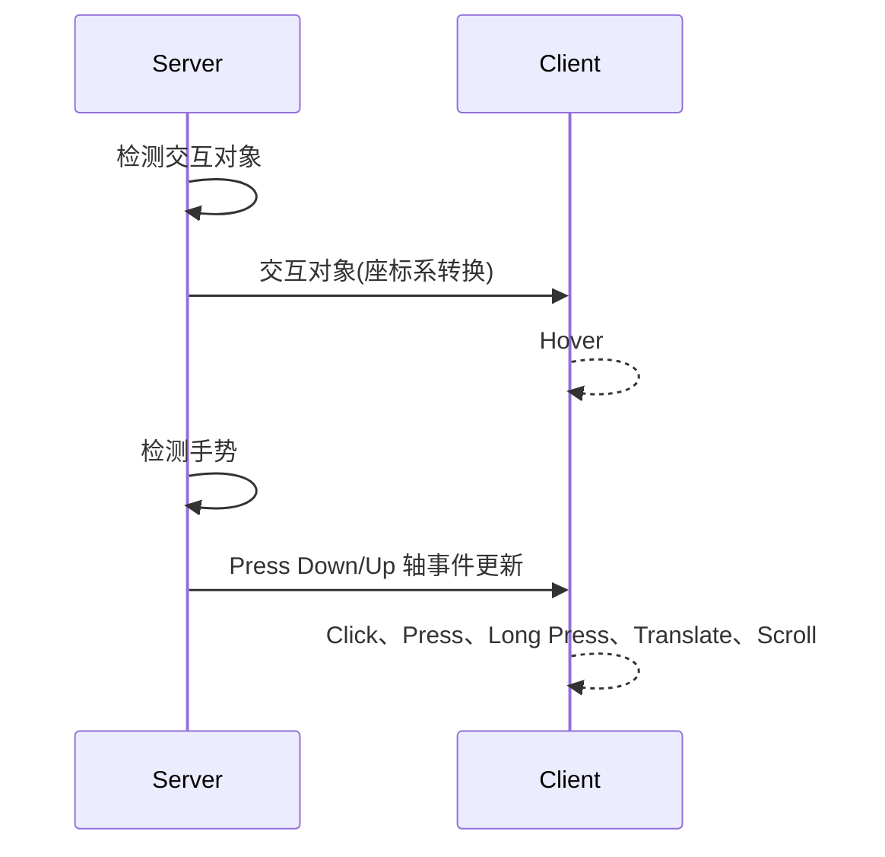
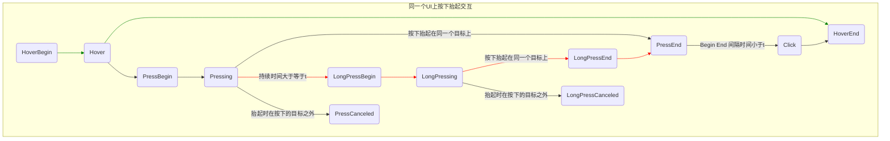

1. 事件处理流程图

```mermaid
graph TB
    Begin --> |Press Down|storeCandidate
    Begin --> |Detect|HoverBegin
    HoverBegin-->HoverUpdate
    HoverUpdate-->|Not Detect|HoverEnd
    storeCandidate-->|pressUp|isInTimeThreshold{"is in time threshold"}
    isInTimeThreshold -->|true| click("click")
    isInTimeThreshold -->|false| clickCancel
    
    storeCandidate-->pressBegin
    pressBegin-->pressUpdate
    pressUpdate-->|pressUp|isSamePressCandidate{"isSamePressCandidate"}
    isSamePressCandidate-->|true|pressEnd
    isSamePressCandidate-->|false|pressCancel

    storeCandidate-->isLongPressTimeThreshold{"long press time"}
    isLongPressTimeThreshold-->|true|LongPressBegin["long press begin"]
    LongPressBegin-->LongPressUpdate["LongPressUpdate"]
    LongPressUpdate-->|Press Up|isSameLongPressCandidate{"isSameLongPressCandidate"}
    isSameLongPressCandidate-->|true|longPressEnd
    isSameLongPressCandidate-->|false|longPressCancel
    
    storeCandidate-->isScroll{"isScrollOffset"}
    isScroll-->|true|CancelEvents
    CancelEvents-->ScrollBegin
    ScrollBegin-->ScrollUpdate
    ScrollUpdate-->ScrollEnd
    
    storeCandidate-->deviceDeactive["device deactive"]
    deviceDeactive-->CancelAllEvents
    
    
 
```

```mermaid
sequenceDiagram
    Server->>Server: 检测交互对象
    Server->>Client: 交互对象(座标系转换)
    Client-->>Client: Hover
    Server->>Server: 检测手势
    Server->>Client: Press Down/Up 轴事件更新
    Client-->>Client:Click、Press、Long Press、Translate、Scroll

```

```mermaid
graph TD;
subgraph AA["同一个UI上按下抬起交互"]
HE(HoverBegin);
H(Hover);
HL(HoverEnd);
C(Click);
PB(PressBegin);
P(Pressing);
PE(PressEnd);
PC(PressCanceled);
LPB(LongPressBegin);
LP(LongPressing);
LPE(LongPressEnd);
LPC(LongPressCanceled);
end

HE --> H --> HL;
H --> PB --> P --> |"按下抬起在同一个目标上"|PE;
P --> |"持续时间大于等于t"|LPB --> LP --> |"按下抬起在同一个目标上"|LPE --> PE;
P --> |"抬起时在按下的目标之外"|PC
LP --> |"抬起时在按下的目标之外"|LPC
PE --> |"Begin End 间隔时间小于t"|C --> HL;

linkStyle 0 stroke:green
linkStyle 1 stroke:green
linkStyle 5 stroke:red
linkStyle 6 stroke:red
linkStyle 7 stroke:red
linkStyle 8 stroke:red

```

检测器优先级： 眼动近场>眼动远场>手柄（手势）近场>手柄（手势）远场>HMD近场>HMD远场

