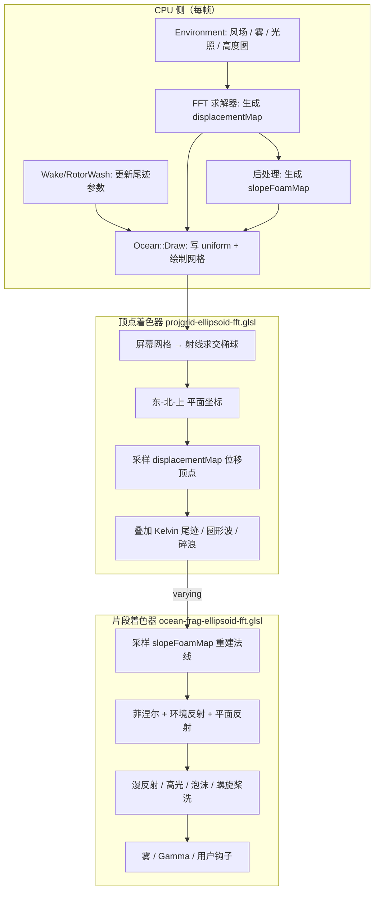
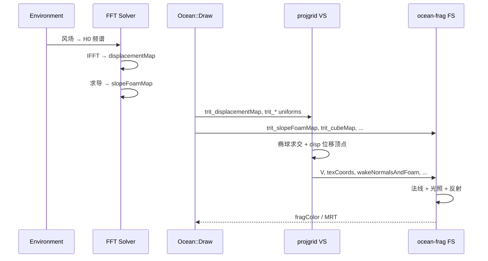

# Triton 椭球 FFT 水体渲染技术文档

> 以 `ocean-frag-ellipsoid-fft.glsl` 为核心，结合 `projgrid-ellipsoid-fft.glsl` 与 `projgrid-ellipsoid-common.glsl`，说明 WGS84/椭球模式下 Triton 海洋的完整渲染逻辑。

---

## 1. 总体架构

Triton 海洋渲染采用 **投影网格（Projected Grid）+ FFT 频谱海浪 + 片段着色光照** 的经典架构。椭球模式面向地球尺度场景（WGS84_ZUP / SPHERICAL），与平面模式（`flat-fft`）共享同一套光照/泡沫逻辑，但坐标映射不同。



**核心思想**：  
- **几何形状**（顶点高度）主要来自 FFT 位移贴图 + 局部尾迹/碎浪。  
- **光照细节**（法线、泡沫、反射）在片段着色器里用 `slopeFoamMap` 等纹理二次重建，比纯顶点法线更精细。

---

## 2. 着色器文件组成

| 文件                             | 角色                                                         |
| -------------------------------- | ------------------------------------------------------------ |
| `projgrid-ellipsoid-common.glsl` | 全部 `trit_*` uniform、纹理、Wake UBO 结构体                 |
| `projgrid-ellipsoid-fft.glsl`    | **顶点着色器**：投影网格、位移、尾迹、输出 varying           |
| `ocean-frag-ellipsoid-fft.glsl`  | **片段着色器**：法线、光照、反射、泡沫、输出颜色             |
| `user-vert-functions.glsl`       | 顶点钩子：`user_intercept`、`overridePosition`、`user_get_depth` |
| `user-functions.glsl`            | 片段钩子：`user_lighting`、`user_fog`、`user_tonemap` 等     |

编译期宏控制可选模块，例如：`BREAKING_WAVES`、`KELVIN_WAKES`、`PROPELLER_WASH`、`LEEWARD_DAMPENING`、`HIGHALT`、`SPARKLE`、`PER_FRAGMENT_PROP_WASH`。

---

## 3. 坐标系

椭球模式不使用 `trit_invBasis`，而用 **东-北-上（ENU）切平面**：

| 变量                       | 含义                                           |
| -------------------------- | ---------------------------------------------- |
| `trit_cameraPos`           | 相机地心坐标（双精度时可 `dvec3`）             |
| `trit_referenceLocation`   | 当前 tile 参考点（地心坐标）                   |
| `trit_north` / `trit_east` | 参考点处北/东单位切向量                        |
| `up = normalize(worldPos)` | 椭球面法线（局部“上”）                         |
| `trit_basis`               | 世界 → 海面局部 Z-up（片段中用于距离/旋翼 UV） |
| `trit_northPole`           | 北极方向（片段中法线混合用）                   |

**平面坐标映射**（顶点着色器）：

```793:797:d:\repos\OpenSceneGraph\SDK\Triton SDK\Resources\projgrid-ellipsoid-fft.glsl
vec3 computeArcLengths(in vec3 localPos, in vec3 northDir, in vec3 eastDir)
{
    vec3 pt = trit_referenceLocation + localPos;
    return vec3(dot(pt, eastDir), dot(pt, northDir), 0.0);
}
```

- `planar.x` ≈ 东向弧长（米）  
- `planar.y` ≈ 北向弧长（米）  
- FFT 纹理坐标：`texCoords = planar.xy / trit_textureSize`

---

## 4. 顶点阶段：几何如何生成

### 4.1 投影网格

1. 输入：屏幕空间 `[0,1]²` 网格顶点（`trit_gridScale` 缩放）。  
2. `projectToSea()`：从近平面/远平面反投影射线，与椭球（或近距平面近似）求交，得到 `worldPos` / `localPos`（相对相机）。  
3. 无交点则把顶点移出 clip space，实现视锥外裁剪。

### 4.2 FFT 位移（主浪）

```854:867:d:\repos\OpenSceneGraph\SDK\Triton SDK\Resources\projgrid-ellipsoid-fft.glsl
        texCoords = planar.xy / trit_textureSize;
        vec3 disp = texture(trit_displacementMap, texCoords).xyz;
        float opacity = 1.0 - transparency;
        disp.z = mix(0.0, disp.z, pow(opacity, 6.0));
        disp = disp * fade;
        localPos.xyz += disp.x * trit_east + disp.y * trit_north;
```

| 分量               | 作用                                                |
| ------------------ | --------------------------------------------------- |
| `disp.x`, `disp.y` | 水平 choppiness，沿 `trit_east` / `trit_north` 偏移 |
| `disp.z`           | 沿 `up` 方向的波高                                  |
| `fade`             | 随相机距离衰减（`trit_invDampingDistance`）         |
| `opacity`          | 浅水/透明时压低 Z 位移（隐藏“背面”波）              |

`trit_displacementMap` 由 CPU FFT 根据当前风场实时生成，**整块 tile 共用一张**，不能仅靠风场 API 做空间变化的平静区。

### 4.3 局部扰动叠加

| 函数                    | 来源                 | 效果                         |
| ----------------------- | -------------------- | ---------------------------- |
| `applyCircularWaves`    | `RotorWash` 等       | 圆形扩散波 + 泡沫            |
| `applyKelvinWakes`      | 船尾 Kelvin 尾迹     | 位移 + 法线斜率 + 泡沫       |
| `applyBreakingWaves`    | 近岸碎浪（需高度图） | Gerstner 型涌浪              |
| `applyPropWash`         | 螺旋桨尾流           | 传递洗流纹理坐标             |
| `applyLeewardDampening` | 船背风侧             | 输出 `leewardDampening` 系数 |

尾迹法线写入 `wakeNormalsAndFoam`（xyz=斜率法线，w=泡沫量），供片段着色器叠加。

### 4.4 顶点输出（→ 片段 varying）

| Varying                                           | 用途                                 |
| ------------------------------------------------- | ------------------------------------ |
| `V`                                               | 相机相对位置（米），片段中作视线方向 |
| `texCoords`                                       | 采样 `slopeFoamMap`                  |
| `foamTexCoords` / `noiseTexCoords`                | 泡沫/噪声 UV                         |
| `up`                                              | 椭球法线                             |
| `wakeNormalsAndFoam`                              | 尾迹法线 + 泡沫                      |
| `fogFactor` / `transparency` / `depth`            | 雾与水深                             |
| `breaker*` / `washTexCoords` / `leewardDampening` | 可选模块数据                         |

---

## 5. 片段阶段：`ocean-frag-ellipsoid-fft.glsl` 详解

`main()` 按以下顺序执行。

### 5.1 早期退出

```260:270:d:\repos\OpenSceneGraph\SDK\Triton SDK\Resources\ocean-frag-ellipsoid-fft.glsl
    bool hasHeightMap = (trit_hasHeightMap || trit_hasUserHeightMap);

    if ( hasHeightMap && depth < 0.0) {
        discard;
        return;
    }

    if (trit_depthOnly) {
        writeFragmentData(vec4(0.0,0.0,0.0,1.0), ...);
        return;
    }
```

- 有高度图且该像素在陆地（`depth < 0`）→ `discard`，实现水陆交界。  
- `trit_depthOnly` → 仅深度 pass。

### 5.2 距离衰减

```274:277:d:\repos\OpenSceneGraph\SDK\Triton SDK\Resources\ocean-frag-ellipsoid-fft.glsl
    float tileFade = exp(-length(V) * trit_invNoiseDistance);
    float horizDist = length((trit_basis * V).xy);
    float horizDistNorm = horizDist * trit_invNoiseDistance;
    float tileFadeHoriz = exp(-horizDistNorm);
```

远处法线/泡沫/噪声渐变为平静海面，减轻 FFT 纹理重复感。

### 5.3 法线重建（核心）

**Step 1 — 采样 FFT 坡度贴图**

```308:316:d:\repos\OpenSceneGraph\SDK\Triton SDK\Resources\ocean-frag-ellipsoid-fft.glsl
    vec4 slopesAndFoam = texture(trit_slopeFoamMap, texCoords, trit_textureLODBias).xyzw;
    // ...
#ifdef DETAIL
    for (int n = 1; n <= NUM_OCTAVES; n++) {
        slopesAndFoam.xyz += texture(trit_slopeFoamMap, texCoords * DETAIL_OCTAVE * n, ...).xyz * DETAIL_BLEND;
    }
#endif
```

- `slopesAndFoam.xyz`：局部 Z-up 下的法线（未转世界）  
- `slopesAndFoam.w`：FFT 泡沫强度  

`HIGHALT` 模式下混合多 LOD 采样，避免高空视角法线闪烁。

**Step 2 — 背风/碎浪修正**

```353:363:d:\repos\OpenSceneGraph\SDK\Triton SDK\Resources\ocean-frag-ellipsoid-fft.glsl
#ifdef LEEWARD_DAMPENING
    slopesAndFoam.xyz = mix(vec3(0.0,0.0,1.0), slopesAndFoam.xyz, leewardDampening);
    slopesAndFoam.w *= leewardDampening;
#endif
#ifdef BREAKING_WAVES
    vec3 realNormal = mix(vec3(0.0,0.0,1.0), slopesAndFoam.xyz, breakerFadeLocal);
#else
    vec3 realNormal = slopesAndFoam.xyz;
#endif
```

**Step 3 — 合成最终法线**

```377:387:d:\repos\OpenSceneGraph\SDK\Triton SDK\Resources\ocean-frag-ellipsoid-fft.glsl
    vec3 fadedNormal = mix(vec3(0.0,0.0,1.0), realNormal, tileFadeHoriz);
    vec3 N = normalize(fadedNormal + (wakeNormalsAndFoam.xyz - vec3(0.0, 0.0, 1.0)));
    vec3 normalNoise = unscaledNoise * trit_noiseAmplitude;
    N += normalNoise;
    vec3 nNorm = normalize(N.x * localEast + N.y * localNorth + N.z * up);
```

法线合成链：

```
FFT坡度(realNormal) → 距离fade → + 尾迹法线 → + 噪声 → 转到世界ENU
```

**Step 4 — 旋翼/涡环自定义扰动**（项目扩展）

```391:404:d:\repos\OpenSceneGraph\SDK\Triton SDK\Resources\ocean-frag-ellipsoid-fft.glsl
    vec3 vLocal = trit_basis * V;
    vec3 rotorLocal = trit_basis * trit_userRotorCenter;
    vec2 uv = (vLocal.xy - rotorLocal.xy) / VORTEX_VISUAL_RADIUS;
    float rippleMask = 1.0 - smoothstep(0.90, 1.0, distUv);
    if (rippleMask > 0.0) {
        vec3 localDelta = getNormal(uv, trit_time) - vec3(0.0, 0.0, 1.0);
        vec3 worldDelta = transpose(trit_basis) * localDelta;
        nNorm = normalize(nNorm + rippleMask * worldDelta);
    }
```

通过 `gerstnerIrregular` / `vortexRing` 程序化生成局部 ripple，仅改**法线**（不改顶点位移）。

### 5.4 反射与折射

```406:428:d:\repos\OpenSceneGraph\SDK\Triton SDK\Resources\ocean-frag-ellipsoid-fft.glsl
    vec3 reflection = reflect(vNorm, nNorm);
    vec3 refraction = refract(vNorm, nNorm, 1.0 / IOR);  // IOR = 1.34
    // 菲涅尔（默认完整公式，非 Schlick 近似）
    float reflectivity = clamp((Fs + Fp) * 0.5, 0.0, 1.0);
    reflectivity = mix(reflectivity, 0.0, foamClamped);  // 泡沫处无反射
    reflectivity *= trit_reflectivityScale;
```

**环境反射**：

```441:468:d:\repos\OpenSceneGraph\SDK\Triton SDK\Resources\ocean-frag-ellipsoid-fft.glsl
    vec4 envColor = textureLod(trit_cubeMap, trit_cubeMapMatrix * reflection, 0);
    vec4 reflectedColor = envColor;
    if (trit_hasPlanarReflectionMap) {
        vec3 vNormPerturbed = vNorm + (nNorm - dot(nNorm, up) * up) * trit_planarReflectionDisplacementScale;
        vec4 planarColor = textureProj(trit_planarReflectionMap, tc);
        reflectedColor = mix(envColor, planarColor, planarColor.a * trit_planarReflectionBlend);
    }
```

平面反射 UV 会用法线 xy 扰动，模拟波浪对反射的扭曲。

### 5.5 光照模型

| 分量   | 计算                                                         |
| ------ | ------------------------------------------------------------ |
| 环境光 | `trit_ambientColor`                                          |
| 漫反射 | `trit_lightColor * max(0, dot(trit_L, nNorm))`               |
| 高光   | Blinn-Phong，`pow(S, shininess + horizDist * 70) * 500 * reflectivity` |
| 水下   | 翻转法线，折射光源方向                                       |
| 阴影   | `user_cloud_shadow_fragment()` 缩放 diffuse/specular         |

```515:515:d:\repos\OpenSceneGraph\SDK\Triton SDK\Resources\ocean-frag-ellipsoid-fft.glsl
    vec3 Cskylight = mix(trit_refractColor * Clight, reflectedColor.rgb * shadow, reflectivity);
```

水体颜色 = 折射底色与反射色的 **菲涅尔混合**，再加高光。

### 5.6 泡沫与洗流

| 来源     | 代码位置                         | 说明         |
| -------- | -------------------------------- | ------------ |
| FFT 泡沫 | `slopesAndFoam.w` → `foamColor`  | 大坡度高光区 |
| 碎浪纹理 | `trit_breakerTex * breaker`      | 近岸卷浪     |
| 尾迹泡沫 | `wakeNormalsAndFoam.w`           | Kelvin 尾迹  |
| 螺旋桨洗 | `trit_washTex` / `applyPropWash` | 白色湍流染色 |
| 双重折射 | `doubleRefraction`               | 模拟波峰透光 |

### 5.7 雾、Alpha 与输出

```582:609:d:\repos\OpenSceneGraph\SDK\Triton SDK\Resources\ocean-frag-ellipsoid-fft.glsl
    float alpha = hasHeightMap ? 1.0 - transparencyLocal : mix(1.0 - transparencyLocal, 1.0, reflectivity);
    vec4 waterColor = vec4(Ci, alpha);
    user_fog(V, waterColor, fogColor4, fogBlend);
    vec4 finalColor = mix(fogColor4, waterColor, fogBlend);
    finalColor.xyz = pow(finalColor.xyz, vec3(trit_oneOverGamma));
    user_tonemap(finalColor, toneMappedColor);
    writeFragmentData(toneMappedColor, ...);
```

- 有高度图：浅水区 alpha 随 `transparency`（水下雾）变化。  
- 无高度图：反射强处更不透明。  
- 最后 Gamma 校正，经 `writeFragmentData` 输出（可接 MRT）。

---

## 6. CPU 与 GPU 数据流



**关键纹理**：

| 纹理                       | 生成方     | 顶点用          | 片段用      |
| -------------------------- | ---------- | --------------- | ----------- |
| `trit_displacementMap`     | CPU FFT    | 顶点位移        | —           |
| `trit_slopeFoamMap`        | CPU 后处理 | —               | 法线 + 泡沫 |
| `trit_displacementTexture` | 预烘焙     | Kelvin 尾迹采样 | —           |
| `trit_lightFoamTex`        | 静态资源   | —               | 泡沫着色    |
| `trit_cubeMap`             | 应用传入   | —               | 天空反射    |

---

## 7. 可选模块一览

| 宏                       | 顶点                    | 片段            | 功能                 |
| ------------------------ | ----------------------- | --------------- | -------------------- |
| `BREAKING_WAVES`         | `applyBreakingWaves`    | `breakerTex`    | 近岸碎浪（需高度图） |
| `KELVIN_WAKES`           | `applyKelvinWakes`      | 尾迹法线        | 船尾 V 形尾迹        |
| `PROPELLER_WASH`         | `applyPropWash`         | `trit_washTex`  | 螺旋桨白沫           |
| `LEEWARD_DAMPENING`      | `applyLeewardDampening` | 缩放坡度        | 船背风减浪           |
| `HIGHALT`                | —                       | 多 LOD 混合     | 高空视角稳定         |
| `SPARKLE`                | —                       | 独立 specNormal | 太阳闪光             |
| `PER_FRAGMENT_PROP_WASH` | 传坐标                  | `applyPropWash` | 逐像素洗流           |
| `DETAIL`                 | —                       | 多 octave 采样  | 法线细节             |

---

## 8. 用户扩展点

| 钩子                     | 文件           | 典型用途                  |
| ------------------------ | -------------- | ------------------------- |
| `user_get_depth`         | user-vert      | 自定义高度图              |
| `user_intercept`         | user-vert      | 传自定义 varying          |
| `overridePosition`       | user-vert      | 对数深度缓冲              |
| `user_lighting`          | user-functions | 改光照                    |
| `user_fog`               | user-functions | 改雾                      |
| `user_reflection_adjust` | user-functions | 改反射                    |
| `user_diffuse_color`     | user-functions | 改最终漫反射              |
| `trit_userRotorCenter`   | 应用 uniform   | 旋翼/平静区（需自行实现） |

---

## 9. 与平面模式（flat-fft）的主要差异

| 项目                   | 椭球 (`ellipsoid-fft`)                         | 平面 (`flat-fft`)      |
| ---------------------- | ---------------------------------------------- | ---------------------- |
| 海面求交               | 椭球/平面近似                                  | 水平面                 |
| FFT UV                 | `planar = dot(pos, east/north)`                | `trit_basis * pos`     |
| 位移方向               | `disp.x * east + disp.y * north + disp.z * up` | `trit_invBasis` 局部系 |
| 法线基                 | `localEast/localNorth/up`                      | `trit_invBasis`        |
| `trit_userRotorCenter` | 相机相对偏移（米）                             | 绝对世界坐标           |

片段光照流程两者基本一致，`ocean-frag-ellipsoid-fft.glsl` 额外多了 ENU 基向量构建和 `trit_northPole` 处理。

---

## 10. 实现/修改时的注意点

1. **顶点 vs 片段分工**：FFT 主浪在顶点位移；精细法线/泡沫在片段。只改片段法线（如旋翼 ripple）不会改变几何交点。  
2. **FFT 是全局 tile 级**：局部“完全平静”需在顶点 `displace()` 乘 mask，片段同步压法线。  
3. **`trit_basis` 在椭球片段中用于水平距离**，与 ENU 法线基并存，扩展自定义效果时需统一坐标系。  
4. **`fade` / `tileFadeHoriz`** 是隐藏重复纹理的关键，改噪声或 foam 时通常要一起考虑。  
5. 高度图模式下 `discard` + `transparency` 共同实现近岸融合，与 `BREAKING_WAVES` 的 `depthFade` 联动。

---

## 11. 相关源码索引

| 路径                                                      | 说明                                  |
| --------------------------------------------------------- | ------------------------------------- |
| `SDK/Triton SDK/Resources/ocean-frag-ellipsoid-fft.glsl`  | 片段主逻辑                            |
| `SDK/Triton SDK/Resources/projgrid-ellipsoid-fft.glsl`    | 顶点主逻辑                            |
| `SDK/Triton SDK/Resources/projgrid-ellipsoid-common.glsl` | Uniform 定义                          |
| `SDK/Triton SDK/Resources/TRITON_SHADER_UNIFORMS.md`      | `trit_*` 变量参考                     |
| `examples/TritonOcean/TritonDrawable.cpp`                 | OSG 集成、`trit_userRotorCenter` 示例 |

---

如需把本文保存为仓库内的 `.md` 文件（例如 `SDK/Triton SDK/Resources/TRITON_ELLIPSOID_RENDERING.md`），告诉我目标路径即可。