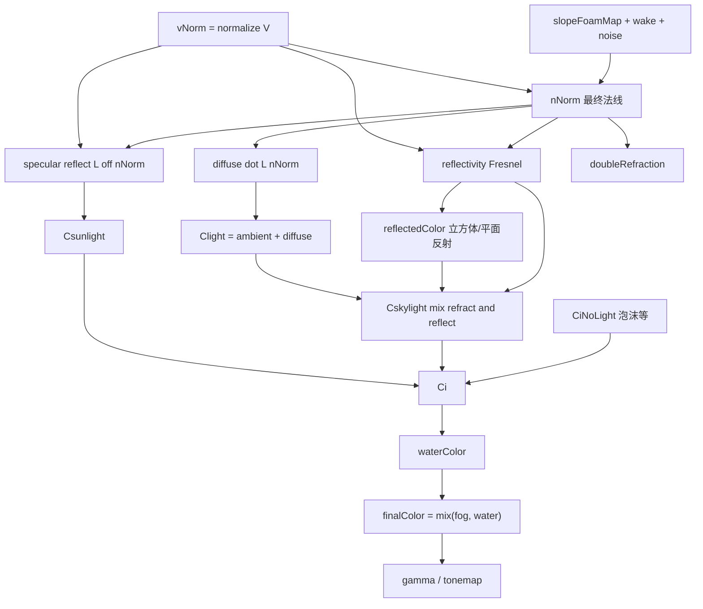

## 总览：`finalColor` 从哪来

`finalColor` 不是单一公式，而是 **水体颜色 `waterColor` 与雾色 `fogColor` 混合** 后再做伽马和 tone map 的结果：

```520:522:d:\repos\OpenSceneGraph\SDK\Triton SDK\Resources\ocean-frag-flat-fft.glsl
    vec4 finalColor = mix(fogColor4, waterColor, fogBlend);

    finalColor.xyz = pow(finalColor.xyz, vec3(trit_oneOverGamma, trit_oneOverGamma, trit_oneOverGamma));
```

核心链路：

```
纹理(坡度/泡沫) + 尾迹 + 噪声 → 法线 nNorm
        ↓
反射率 + 环境/平面反射 + 漫反射/高光 → Ci
        ↓
+ 泡沫/碎浪/螺旋桨尾流 → Ci
        ↓
waterColor(Ci, alpha) ──mix(fogBlend)──► finalColor ──pow(gamma)──► toneMappedColor
```

---

## 1. 两种“方向向量”：别和法线混

| 符号        | 计算              | 含义                                   |
| ----------- | ----------------- | -------------------------------------- |
| **`V`**     | varying，顶点传入 | 相对相机的海面点位置                   |
| **`vNorm`** | `normalize(V)`    | **视线方向**（从顶点到相机），不是法线 |

```201:201:d:\repos\OpenSceneGraph\SDK\Triton SDK\Resources\ocean-frag-flat-fft.glsl
    vec3 vNorm = normalize(V);
```

后面反射、高光、双重折射都用 `vNorm` 和 **法线 `nNorm`** 的夹角。

---

## 2. 法线 `nNorm` 怎么拼出来

### 2.1 基础：FFT 坡度纹理

从 `trit_slopeFoamMap` 采样得到 `slopesAndFoam`：
- **`.xyz`**：水面微法线/坡度（归一化后）
- **`.w`**：泡沫强度

可加细节 octave、噪声 `normalNoise`、尾迹法线 `wakeNormal`、碎浪混合等。

### 2.2 合成 `realNormal` → `nNorm`

```288:314:d:\repos\OpenSceneGraph\SDK\Triton SDK\Resources\ocean-frag-flat-fft.glsl
    vec3 wakeNormal = normalize(cross(wx, wy));
    ...
    realNormal = normalize(realNormal + wakeNormal);
    ...
    vec3 fadedNormal = mix(vec3(0.0,0.0,1.0), realNormal, tileFadeHoriz);

    vec3 nNorm = trit_invBasis * normalize(fadedNormal + (normalNoise * (1.0 - tileFade)));
```

要点：
- 远处用 `tileFadeHoriz` 把法线拉向 **竖直 `(0,0,1)`**，减少远处波纹锯齿
- `trit_invBasis` 把法线变到与光照、反射一致的 **世界相关坐标系**
- **`nNorm` 是片段里用的最终着色法线**

---

## 3. 法线在颜色里的作用（按计算顺序）

### 3.1 菲涅尔 / 反射率 `reflectivity`

```316:346:d:\repos\OpenSceneGraph\SDK\Triton SDK\Resources\ocean-frag-flat-fft.glsl
    vec3 P = reflect(vNorm, nNorm);
    ...
    float reflectivity = ... pow((1.0-dot(nNorm,P)) * fresnelScale, 4.0);  // FAST_FRESNEL
    // 或完整 Fresnel 用 dot(P,nNorm)、折射角
```

- **`P`**：视线经水面反射后的方向 → 采样立方体贴图
- **`reflectivity`**：法线越“平”、视角越掠射，反射越强；泡沫处被压到 0

法线决定 **看反射多还是看透射/折射色多**。

### 3.2 环境反射 + 平面反射 `reflectedColor`

```355:387:d:\repos\OpenSceneGraph\SDK\Triton SDK\Resources\ocean-frag-flat-fft.glsl
        envColor = textureLod(trit_cubeMap, trit_cubeMapMatrix * P, 0);
    ...
        vec3 vNormPerturbed = vNorm + ( nNorm - dot( nNorm, up ) * up ) * trit_planarReflectionDisplacementScale;
```

- 立方体贴图：沿 **`P`** 采样
- 平面反射：用 **`nNorm` 的水平分量** 扰动视线，模拟波纹扭曲反射

### 3.3 漫反射 `finalDiffuse`

```398:398:d:\repos\OpenSceneGraph\SDK\Triton SDK\Resources\ocean-frag-flat-fft.glsl
    vec3 finalDiffuse = trit_lightColor * max(0,dot(trit_L, nNorm));
```

经典 **Lambert**：法线与太阳方向夹角决定受光强度。

### 3.4 高光 `finalSpecular`（`Csunlight`）

```410:416:d:\repos\OpenSceneGraph\SDK\Triton SDK\Resources\ocean-frag-flat-fft.glsl
    vec3 R = reflect(refractedLight, nNorm);
    float spec = max(0.0, dot(vNorm, R));
```

- **`R`**：太阳经法线反射方向
- **`spec`**：视线与 `R` 对齐程度 → Phong 高光
- 再乘 `reflectivity`（掠射更亮）、距离衰减、`trit_shininess`

法线决定 **太阳高光斑的位置和锐度**。

### 3.5 水体主色 `Cskylight`（折射 vs 反射混合）

```442:442:d:\repos\OpenSceneGraph\SDK\Triton SDK\Resources\ocean-frag-flat-fft.glsl
    vec3 Cskylight = mix(trit_refractColor * Clight, reflectedColor.rgb * vec3(shadow), reflectivity);
```

- **`reflectivity` 高** → 偏 `reflectedColor`（天空/场景反射）
- **`reflectivity` 低** → 偏 `trit_refractColor * Clight`（水下折射色调 × 环境光+漫反射）

`Clight = finalAmbient + finalDiffuse`，漫反射仍依赖 **`dot(trit_L, nNorm)`**。

### 3.6 双重折射 `doubleRefraction`

```503:508:d:\repos\OpenSceneGraph\SDK\Triton SDK\Resources\ocean-frag-flat-fft.glsl
    float doubleRefraction = max(0.0,dot(-vNorm,nNorm)) * (1.0 - dot(-vNorm, trit_invBasis[2]));
    ...
    Ci += trit_doubleRefractionColor * Clight * doubleRefraction * trit_doubleRefractionIntensity;
```

视线与法线关系决定额外散射项（气泡、碎浪 `.w` 也会加大）。

### 3.7 泡沫等（法线间接）

泡沫 **`CiNoLight`** 主要来自纹理和 `finalSlopesAndFoam.w`，不直接 `dot(L, nNorm)`，但泡沫会 **`mix(reflectivity, 0)`** 关掉反射，整体变“哑光白沫”。

---

## 4. 合成 `Ci` → `waterColor` → `finalColor`

```507:520:d:\repos\OpenSceneGraph\SDK\Triton SDK\Resources\ocean-frag-flat-fft.glsl
    vec3 Ci = Cskylight + Csunlight + CiNoLight;
    Ci += trit_doubleRefractionColor * Clight * doubleRefraction * trit_doubleRefractionIntensity;
    ...
    vec4 waterColor = vec4(Ci, alpha);
    ...
    user_fog(V, waterColor, fogColor4, fogBlend);
    vec4 finalColor = mix(fogColor4, waterColor, fogBlend);
```

| 分量          | 来源               | 与法线关系                         |
| ------------- | ------------------ | ---------------------------------- |
| **Cskylight** | 折射色 ↔ 反射色    | 强（`reflectivity`、反射向量 `P`） |
| **Csunlight** | 高光               | 强（`reflect(R, nNorm)`）          |
| **CiNoLight** | 泡沫、尾迹、螺旋桨 | 弱（主要通过压低 reflectivity）    |
| **双重折射**  | 额外散射           | 中（`dot(-vNorm, nNorm)`）         |

`fogBlend` 来自顶点 varying（距离雾），与法线无关。

之后：

1. `pow(..., trit_oneOverGamma)` — 伽马校正  
2. `user_tonemap` — 用户可调  
3. `toneMappedColor.w *= trit_transparency`  
4. 你加的涡环区域红色覆盖（在 `writeFragmentData` 前）

---

## 5. 流程图（简化）



---

## 6. 一句话总结

- **`finalColor`** = 雾与 **水体 RGB `Ci`** 按 `fogBlend` 混合，再伽马校正。  
- **`Ci`** = 天空/反射主导项 **Cskylight** + 太阳高光 **Csunlight** + 泡沫等 **CiNoLight** + 双重折射。  
- **法线 `nNorm`** 贯穿：决定反射多少（Fresnel）、反射往哪采样、漫反射强弱、高光方向、平面反射扭曲、双重折射强度；**不直接出现在 `finalColor = mix(...)` 那一行**，但几乎主导 `Ci` 的明暗和色调。

若你希望，我可以在 Agent 模式下给 `ocean-frag-flat-fft.glsl` 加一段注释版“颜色计算索引”，方便以后对照改 shader。