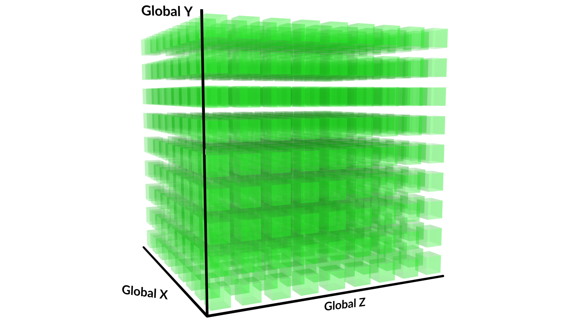
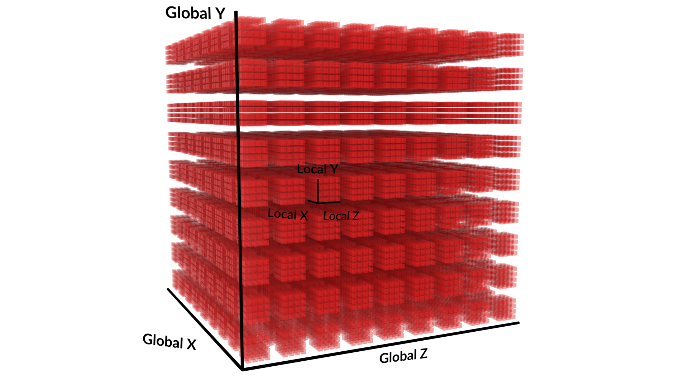

**GPGPU-programming**: General Purpose Computing on Graphics Processing Units 


#### CPU & GPU 

1. CPU 是串行处理器：指令依次执行，计算任务具有顺序依赖性；
2. GPU是流处理器：程序指令在多个gpu核上并行运行，gpu之间相互独立，互不影响；

#### 输入输出

1. Computer Shader不在渲染管线中，没有预定义的输入输出，其输入和输出都完全由开发者**显式地定义和管理**

2. Computer Shader 通过读写各类资源，来实现与外部（CPU或其他着色阶段）的数据交换；资源分为两类：

   - 只读资源：Buffer、Texture，用于传入数据；
   - 可读写资源：RWBuffer、RWTexture,RWStructedBuffer,用于输出和存储计算结果；

3. 通过**Buffer**定义输入输出

   - 常量缓冲区(cbuffer):

     - 用于传递少量、每次dispatch调用中恒定不变的参数:矩阵、向量、基础数据等；
     - 是只读的，每帧或每次dispatch前由GPU更新一次；
     - 大小限制（通常64kb）；

   - 结构化缓冲区(StructedBuffer)：

     - 用于传递只读的结构化数组;

     - 定义：

       ```glsl
       // 首先定义一个结构体
       struct Particle {
           float3 position;
           float3 velocity;
           float4 color;
       };
       
       // 声明一个只读的结构化缓冲区
       StructuredBuffer<Particle> InputParticles : register(t0); // ‘t’ 代表纹理寄存器，常用于只读资源
       ```

   - 可读写结构化缓冲区（RWStructedBuffer）

     - 用途：输出、存储计算结果
     - 特点：
       - 可读写
       - 支持原子操作，用于多个线程安全地操作同一数据；

   - 字节地址缓冲区 (ByteAddressBuffer) / 可读写版本 (RWByteAddressBuffer)

4. 通过**Texture**定义输入输出 ：纹理通常用于图像处理，可以表示为网格（2D/3D）的数据都可以使用纹理

   - 纹理（Texture2D/Texture3D）
     - 用途：只读输入，高度图、查找表等；
     - 访问： 使用采样器 (`Sampler`) 或 `.Load()` 函数（通过整数坐标精确获取纹素）;
   - 可读写纹理（RWTexture2D/RWTexture3D）
     - 用途:输出计算结果到纹理，结果也可以直接显示到屏幕；
     - 特点：
       - 某些格式支持原子操作；
       - 不能使用sampler、只能使用坐标访问（采样器会对材质生成mipmap）；

5. 工作流

   - CPU端：
     - 创建所需的资源，各种缓冲区、Texture；
     - 创建 **着色器资源视图** 绑定到 `t` 寄存器（‘t’ 代表纹理寄存器，用于只读资源）；
     - 创建 **无序访问视图** 绑定到 `u` 寄存器（‘u’ 代表无序访问视图 (UAV) 寄存器，用于可读写资源）；
     - 创建 **常量缓冲区** 绑定到 `b` 寄存器；
     - 将输入数据填充到以上各资源中；
     - 调用Dispatch（X,Y,Z） 启动Computer Shader；
   - GPU端（Computer Shader）
     - 通过register语法声明对应的资源变量，与CPU端创建的视图匹配；
     - 通过系统内置的线程ID（SV_DispatchThreadID），确定当前线程要处理的数据单元；
     - 从只读资源（t\b寄存器）中读取数据，进行计算，计算结果写入可写资源（u寄存器）；
     - （可选）使用原子操作或线程同步，来处理线程间的协作问题；

6. 线程

   - Work Group(工作组/线程组)

     - 一组 **Invocation** 的集合,
       - 工作组内的线程**共享一块快速的片上内存（Shared Memory / Thread Group Shared Memory）**。这是实现线程间高效协作和通信的基础。
     - **`Dispatch(X, Y, Z)`** : 创建X * Y * Z个线程组\工作组；
     
   - Invocation（调用/线程）

     - 最基本的执行单元，在一个数据元素上的一次执行；
     - **`[numthreads(X, Y, Z)]`** ： 规定每个工作组\线程组有X * Y * Z个线程

   - 为什么都是三维的：

     - 为了处理体素或LUT这种3D纹理，此时需要定义3D的工作组，每个工作组负责一个局部3D区域的计算；更加直观高效，设计为2D则处理3D纹理时需要坐标映射计算；

     - **`SV_DispatchThreadID`**：这是最重要的系统值。它是一个三维向量，代表**全局坐标**。

       - 假设你要处理一张 1920x1080 的图片：

         - `Dispatch(1920/8, 1080/8, 1)` = `Dispatch(240, 135, 1)`

           

         - `[numthreads(8, 8, 1)]`

           

       - 那么，一个线程的 `SV_DispatchThreadID.xy` 范围就是 `(0-1919, 0-1079)`，这**完美地对应到了图像上的每一个像素坐标**。这个线程就知道该去处理哪个像素。

   - 总线程数： 以上Dispatch和numthreads相乘；

   - 需要综合考虑纹理数据维度、硬件缓存偏好、算法需求等，来决定 **`Dispatch`** 、**`numthreads`**的维度；

   - 如何执行：

     - work group的执行是完全独立、无序的，由Streaming Multiprocessor（SM）执行；
     - 一个work group内invocation可以被划分到不同warp，同一warp内的invocation是统一执行的；
     - 最佳实践：为每个 Work Group 分配 **整数个** Wavefront（32/64线程invocation）。如果 Work Group 的大小不能整除 Wavefront 大小，最后一个（甚至几个）Wavefront 就必然无法被填满，造成硬件计算资源的浪费；该问题称为线程浪费或尾部效应；

7. OpenGL相关接口

   1. glMemoryBarrier
     - 原理：
       - GPU是**高度并行**的，**乱序执行**，与CPU顺序执行完全不同；GPU也有**多级缓存**，以及不同类型的内存，数据可能会暂时停留在某个缓存中而不是立即写入内存；

       - 由于上述特性，当在一条渲染命令中写入数据，并希望在接下来一条渲染命令中读取最新结果时，可能会读到旧的数据；

       - **如果没有同步，GPU 的乱序执行和缓存可能会导致下一个命令读到的是旧的、未更新的数据**

     - 作用：内存同步，强制进行同步，控制内存的可见性；核心功能有两个：
       - 执行屏障：确保在glMemoryBarrier调用之前的所有相关渲染指令（特别是写入）都已在GPU执行完毕；

       - 内存可见性屏障：确保在glMemoryBarrier调用之前的写入数据从缓存中写入到内存中；

     - 参数：接受一个 bitfield参数，指明需要同步的数据类型，该类型的写入操作必须完成；
     - 使用场景：只要渲染命令 B 依赖于渲染命令 A 的**写入结果**，而它们之间没有默认的同步（如帧缓冲切换），就需要 `glMemoryBarrier`

   2. gl_NumWorkGroups:**在CPU端通过 `glDispatchCompute(GLuint num_groups_x, num_groups_y, num_groups_z)` 调用所分派的全局工作组数量**

   3. gl_WorkGroupSize:**工作组三个维度，由 `layout (local_size_x...)` 定义的布局格式决定**

   4. **`gl_WorkGroupID`**：当前线程位于**哪一个**工作组中（范围从 `ivec3(0,0,0)` 到 `gl_NumWorkGroups - ivec3(1,1,1)`）。
   5. **`gl_LocalInvocationID`**：当前线程在**其所属的工作组内部**的ID（范围从 `ivec3(0,0,0)` 到 `gl_WorkGroupSize - ivec3(1,1,1)`）。
   6. **`gl_GlobalInvocationID`**：当前线程在**全局所有线程中**的唯一ID。它的计算方式是：
      `gl_GlobalInvocationID = gl_WorkGroupID * gl_WorkGroupSize + gl_LocalInvocationID`

8. 

   

