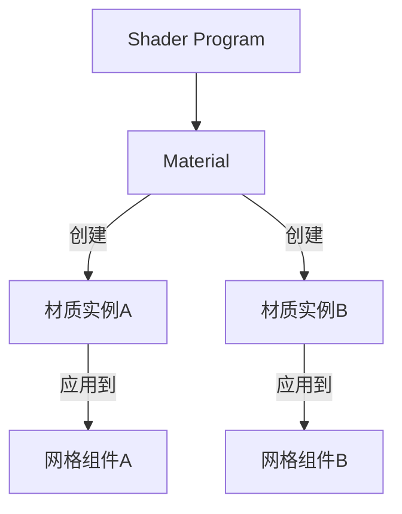

#### **关键设计特点**

1. #####  Shader 自动变体生成

   ##### Filament 在编译 Material 时会根据：

   - 平台特性（GL/Vulkan/Metal）

   - 光照模型（lit/unlit）

   - 阴影设置

     自动生成 **多个 Shader 变体**，运行时根据场景动态选择。

2. 参数继承机制

   ```mermaid
   graph BT
       Shader[Shader 参数声明] --> Material
       Material[默认参数值] --> MaterialInstance
       MaterialInstance[覆盖参数值] --> 实际渲染
   ```

   

#### 关系图




#### Material 材质模板

1. 定义了完整的渲染管线状态（混合模式、深度测试等）
2. 包含编译后的shader程序（通过 .mat 文件编译）
3. 声明材质参数接口（uniform、纹理slot）
4. 一个Material可以创建多个Material Instance

#### Material Instance 材质实例

1. Material 的具体运行时实例
2. 允许在运行时修改参数而不重新编译Shader
3. 持有Shader参数的实际值
4. 直接绑定到渲染对象MeshComponent

#### 创建

1. 创建Material（包含Shader）,通过 `.mat` 文件定义材质，使用 `matc` 工具编译为二进制 `.filamat` 文件，在引擎加载

   - .mat定义

     ```glsl
     // 定义材质参数接口
     material {
         name : "MyMaterial",
         parameters : [
             { type: float4, name: baseColor },
             { type: sampler2d, name: albedo }
         ],
         // 包含着色器代码（自动组装成完整Shader）
         vertexShader : """
             void materialVertex(inout MaterialVertexInputs material) {
                 // 顶点处理逻辑
             }
         """,
         fragmentShader : """
             void materialFragment(inout MaterialFragmentInputs material) {
                 // 使用定义的参数
                 material.baseColor = materialParams.baseColor;
                 material.albedo = texture(materialParams_albedo, getUV0());
             }
         """
     }
     ```

   - 引擎加载，创建Material

     ```c++
     Material myMaterial = Material.Builder()
         .package(resources, R.raw.mymaterial) // 加载.filamat
         .build(engine);
     ```

2. 创建Material Instance

   ```c++
   // 从Material创建实例
   MaterialInstance matInstance = myMaterial.createInstance();
   
   // 设置Shader参数
   matInstance.setParameter("baseColor", 1.0f, 0.0f, 0.0f, 1.0f); // RGBA
   matInstance.setParameter("albedo", texture); // 绑定纹理
   ```

3. 绑定到渲染对象

   ```c++
   // 创建渲染实体
   Entity entity = EntityManager.get().create();
   
   // 添加渲染组件
   RenderableManager.Builder(1)
       .geometry(0, RenderableManager.PrimitiveType.TRIANGLES, vertexBuf, indexBuf)
       .material(0, matInstance) // 绑定材质实例
       .build(engine, entity);
   ```

#### 设计总结

```
Shader → 定义算法
Material → 固化算法（Shader）+状态
Material Instance → 配置shader参数、模板、深度等
Mesh Component → 应用算法到几何体

Material：Shader  1: 1
Material:Material Instance 1:n
MeshComponent:Meterail Instance 1:1
```

