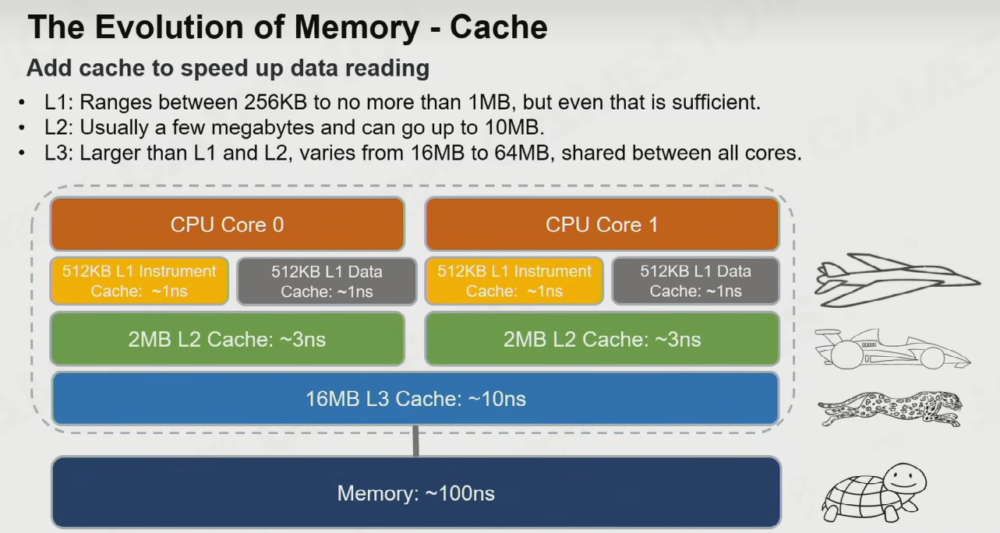
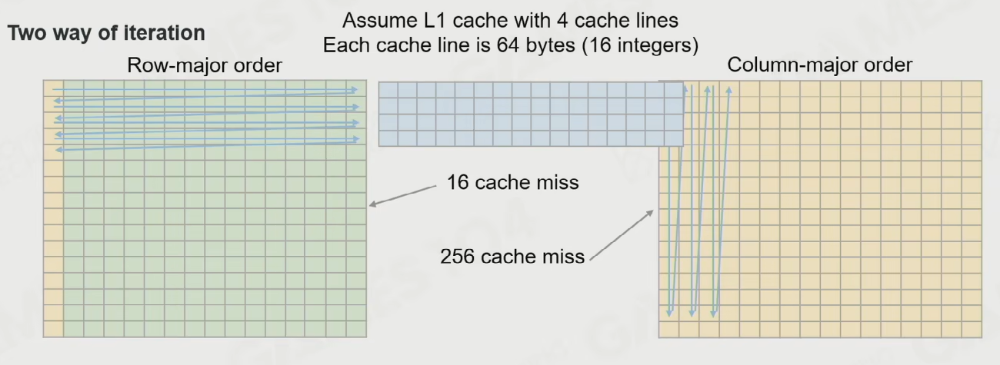

### 并行编程

1. 进程与线程；
2. 线程上下文的切换代价非常昂贵，需要一千到一百万个CPU周期；
3. 协程：用户态、轻量的线程，在一个核上执行；适合IO密集的任务；

### 游戏引擎并行架构

1. **固定多线程架构**：渲染、模拟、逻辑、网络等，容易实现；缺点是很难保证每个thread的**负载均衡**，有时渲染是瓶颈、有时其他线程是瓶颈；并且线程不能根据CPU核数进行适配，多余4个核会闲置，少于四个核会竞争；

   

2. **Fork-Join 线程架构**：基于固定多线程架构，在某些线程计算量大的时候，fork出来多个工作线程（子任务），来协助处理数据；优点是相对固定多线程能**更多的利用CPU多核资源**，对多核CPU的适应性稍微好一些；缺点是线程之间的**工作负载依然不均衡**，过多的线程切换也会带来**性能开销**；

  

3. ##### Task Graph

   - 节点与边组成的有向无环图
      - 节点：任务
      - 边：依赖关系
   - 缺点：静态的有向无环图无法处理临时的需要动态创建执行的任务

### 任务系统：Fiber-based Job System

### 面向数据的编程

1. 三层缓存机制

   

2. SIMD：单指令多数据，4倍加速，处理16字节数据（4个4字节）；

3. LRU(Least Rencently Used) : 将缓存中最长时间不用或者说最少使用的数据丢弃；

4. Cache Line : 列主序的矩阵比行主序的矩阵 Cache Miss 严重的多；

   

5. 面向数据的编程:性能提升100倍；

   - 核心思想：尽量保证代码与数据在内存、缓存中紧密相邻；

   - **分支预测**

     - if中的代码与else中的代码是独立的，在CPU中正在处理if的分支时，下一次进入else分支，需要把else的代码从内存中调入缓存，导致性能较差；

     - ##### 1. 现代CPU的工作原理：指令流水线

       想象一下洗车。一个传统的洗车店有多个步骤：喷水、打泡沫、刷洗、冲洗、擦干。如果每个步骤都需要前一个完全完成后才能开始，效率就很低。

       CPU也是如此。它执行一条指令也分为多个阶段（取指、解码、执行、访存、写回）。**指令流水线** 允许CPU像流水线一样工作：当一条指令在执行阶段时，下一条指令已经在解码，再下一条正在取指。这样可以每个时钟周期都完成一条指令，极大提高吞吐量。

       ##### 2. `if/else` 如何破坏流水线？

       `if/else` 是一种**控制冒险（Control Hazard）**。问题在于：当CPU的取指单元遇到一条分支指令（如 `if`）时，它**不知道下一条该取哪里的指令**——是 `if` 块内的指令，还是 `else` 块后的指令？

       在简单的CPU中，它必须**等待**（即流水线**停顿**或**冒泡**），直到 `if` 的条件被计算出来（执行阶段完成），才能知道该去哪里取下一条指令。这种等待会浪费好几个时钟周期，严重降低效率。

       ##### 3. 解决方案：分支预测

       为了克服这个问题，现代CPU都配备了非常复杂的**分支预测器（Branch Predictor）**。它的工作就是：**在条件结果还不知道的时候，猜测 `if` 会走哪条路。**

       - **预测正确**：CPU继续无缝工作，流水线满载运行，性能零损失。这就是理想情况。
       - **预测错误**：这就糟糕了。CPU必须承认错误，**“清空流水线”**（Flush the Pipeline）。这意味着所有在错误路径上已经预取、解码的指令都会被作废，然后从正确的地址重新开始填充流水线。这个过程的惩罚非常高昂，可能会浪费 **10-20 个时钟周期**。

       ##### 4. 这与“面向数据编程”有何关系？

       这就是最关键的部分！**分支预测器的效果高度依赖于数据的模式。**

       - **可预测的分支（高性能）**：
         - **规律性强**：例如，一个循环`for (int i = 0; i < 1000; i++)`，其中的 `i < 1000` 条件只有在最后一次会失败，预测器几乎每次都能猜对。
         - **始终为真或始终为假**：比如 `if (debug)` 在生产环境中总是 `false`，预测器会很快学习到这一点。
       - **不可预测的分支（低性能）**：
         - **完全随机**：如果 `if` 的条件像一个随机数生成器，True 和 False 毫无规律，预测器的正确率会只有50%，导致大量的预测失败和流水线清空。
         - **面向数据编程的切入点**：如果你的数据布局能让分支条件变得有规律，就能极大提升预测成功率

### ECS架构

1. 

