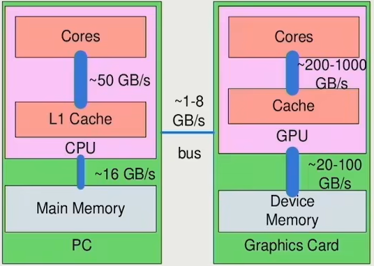
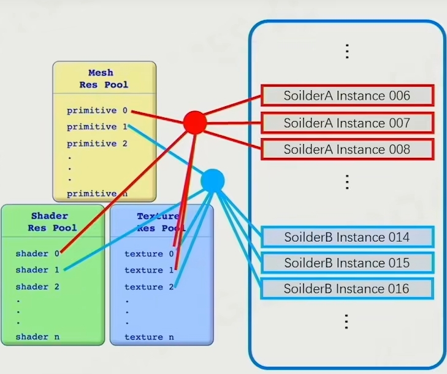
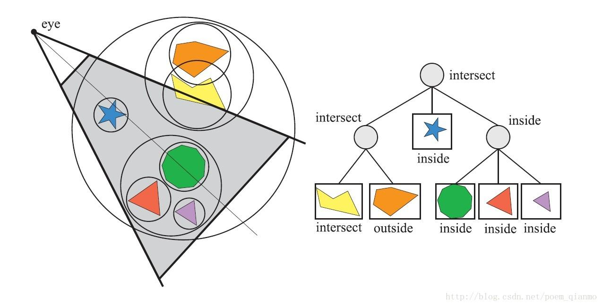
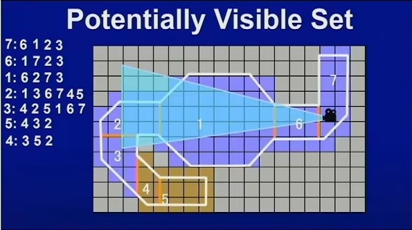

#### 纹理采样

1. 步骤

   - 获取两个最近的mipmap

   - 分别对两个mipmap进行双线性插值（bilinear interpolation），得到两个插值结果
     1. 双线性插值：先在水平方向进行两次线性插值，然后在垂直方向（或者先垂直再水平）对前两次插值的结果再进行一次线性插值

   - 对两个插值结果进行线性插值

2. 以上步骤，一共采样了8个像素点，进行了7次插值；

#### 游戏渲染基础

1. GPU硬件架构
   - SIMD (Single Instruction Multiple Data):单指令多数据：一条指令同时处理多个数据相同的运算；
     - 具体同时计算几个数据，取决于 **SIMD寄存器位宽 (bits) / 单个数据元素位宽 (bits)**
     - Vec4 做一次加法，xyzw同时运算；
     - C++ SIMD指令集扩展： **SSE (Streaming SIMD Extensions)**
     
   - SIMT(Single Instruction Multiple Threads)：单指令多线程：一条指令可以在N个核上并行处理N个数据的同样的运算操作，是GPU的并行执行模型

     - 硬件层：将多个线程（通常是32个，称为一个warp）捆绑在一起，执行同一条指令
     - 软件层：编写单一线程的代码，硬件自动将其复制到多个线程上并行执行；

   - GPU 费米架构

     - GPC（Graphics Processing Cluster）：图形处理集群
       - 多个SM
       - 光栅引擎：光栅化操作
       - 多边形引擎
       - GPC缓存、内存接口
     - SM（Streaming Multiprocessor）：流式多处理器，包含以下部件
       - 32个CUDA Core
       - 线程调度器
       - 共享内存、L1缓存、寄存器
       - 纹理单元：从纹理内存中采样并过滤
     - CUDA Core ： 执行单个线程的实际算术和逻辑运算

   - 数据从CPU到GPU的传输是性能瓶颈

     - 因该瓶颈的存在，尽量只做CPU到GPU的单向数据传输，GPU只管绘制不管逻辑

     

   - 缓存 ：数据如果放在缓存中，需要尽量放在一起，并且不能太大；

     - Cache Hit : 数据在缓存中
     - Cache Miss ：数组不在缓存中

   - 手机的GPU架构：Tile-Base Rendering ,划分成多个瓦片分别进行渲染；

     - 主要用于解决传统**立即模式渲染**在内存带宽的瓶颈，尤其应用于移动设备
     
     - GPU的on-chip memory/Tile Memory 刚好能够容纳一个瓦片的颜色、深度、模板等数据
     
     - 受益于 Tile 内完整的深度信息，可以提前进行深度测试（Early-Z）和隐藏面消除（HSR）
       - 隐藏面消除（HSR：Hidden Surface Removal）：在片段着色之前，丢弃所有被遮挡的片段；
       
         - 通过维护深度缓冲区，保证每个像素位置只计算和保留深度最小的片段；
         - 原理：三角形光栅化之后，拿到片段的深度，与深度缓冲对比，小于则执行片段着色并更新深度缓冲；大于则不执行片段着色，避免overdraw;
       
       - 提前深度测试(Early-Z)：
       
         - 传统的图形管线中，深度测试（Z-Test）是在片元着色器（Fragment Shader）**之后**进行的,**Early-Z** 将深度测试尽可能**提前**到片元着色器**之前**执行，对光栅化生成的片段进行深度测试；从而尽早丢弃那些注定不可见的片元,避免OverDraw
       
       - **提前深度测试**是深度缓冲算法在现代GPU上高效实现**隐藏面消除**的核心机制
       
         

2. 可渲染物体

   - renderable

     - 网格 Primitive ：Vertex 、index 、UV
     - 材质
       - 纹理：Normal、Albedo、Metallic、Roughness、AO
       - Shader ：渲染模型：phone、blin-phong、PBR

   - submesh：

     - 根据GO各部分mesh所用的材质的不同，将mesh切分成多个submesh;

     - 每个Submesh有单独的网格、材质；

     - Submesh数据上是Indexbuffer的Index Range；

     - 多个GO可以复用相同的Submesh，其网格、材质等资源，使用资源池管理，节省存储空间；

       

   - GPU Batch Rendering：渲染物体时，一次性设置一堆一模一样的物体的VB、IB和其位移数据，然后一个draw call指令，将所有设置的物体全部绘制出来，提高效率；

     - 在单次 Draw Call 中，尽可能多地渲染使用相同渲染状态（主要是材质/Shader）的物体（或物体的部分 - Submesh）
     - 实现：
       - 静态合批：在Baking或加载时，将使用**相同材质**多个静态（不移动、不变形、不改变材质）的Mesh合**并成**一个更大的Mesh，发起一次Draw Call绘制；常用于静态建筑地形；
       - 动态合批：在运行时，每帧查找使用**相同材质**的Mesh，将这些Mesh复制到顶点、索引缓冲区，然后发起一次Draw Call绘制；
       - Instancing:
         - GPU绘制时，把**相同材质、相同mesh**的多个实例放到一起绘制：高效的绘制同一个mesh(submesh)的多个完全相同的实例，这些实例可以有不同的位置、旋转、缩放、颜色等；
         -  实例数据缓冲区：存放每个实例不同的数据：位置、旋转、缩放、颜色等;
         - 单次Draw Call，绘制一个Mesh的N个不同数据实例；draw call 次数：N-->1；

3. 可见性裁剪 visibility culling

   - 可见性裁剪：减少发送给图形管线进行光栅化和着色的图元（三角形）数量，从而提升性能

     - 视锥体剔除(View Frustum Culling)：剔除视锥体外的物体

     - 遮挡剔除(Occlusion Culling)：剔除视锥体内，但是被遮挡的物体

     - 背面剔除(Backface Culling)：剔除背向摄像机的图元，通常在顶点处理阶段自动完成

     - 入口剔除(Portal Culling )：利用预定义的单元格确定可视区域；

   - 使用包围盒做裁剪，判断包围盒是否在视锥体中；

     

   - BVH (Bounding Volume Hierarchy) Culling

     - BVH本身是一种**空间加速数据结构**，通过递归地将场景中的几何体组成提个层次化的**包围体树**来实现高效的碰撞检测、射线相交查询、以及**可见性裁剪**

     - 核心思想：

       - 为场景中的每个（或一组）物体，创建简单的包围体（通常是AABB包围盒）
       - 将位置相近的包围体组合起来，创建一个更大的父包围体
       - 递归地进行这种组合，直到形成一个树状结构
       - 在裁剪时，从根节点开始遍历整棵树
         - 如果节点的包围体，完全位于视锥体外，则这个节点及其所有子节点所包含的物体都不可见，整颗子树剔除
         - 如果节点的包围体，完全位于视锥体内，则整颗子树都被渲染，节点所包含的物体都可见（也可能被遮挡剔除）
         - 如果节点的包围体与视锥体相交，则递归检测其子节点，重复上述过程；

       

     - BVH优势：高效、对数级复杂度O(log n)、通用（也用于光追、物理碰撞检测）

     - BVH劣势：如果物体移动，BVH需要更新或重建，适合动态程度不高的场景；不解决物体遮挡剔除；

   - 视锥体剔除(View Frustum Culling-VFC)：

     - 原理：测试物体（或其包围体）是否与由摄像机定义的 6 个平面（近、远、左、右、上、下）组成的平截头体（视锥体）相交。完全在外的剔除。
     - 实现：
       - **包围体测试**：计算物体的包围盒与视锥体平面的关系
       - **层次加速**：结合空间加速结构（BVH等），实现剔除

   - 遮挡剔除(Occlusion Culling - OC):

     - 目的：识别并剔除在视锥体内，但被更靠近相机的不透明物体**完全遮挡**的物体；

     - 原理：遮挡物的包围盒写入到深度图，对被遮挡物的包围盒进行深度测试，返回深度测试通过的像素数，如果像素数为0，则完全被遮挡，否则需要渲染被遮挡物；

     - 方法：

       - **基于硬件的遮挡查询（Occlusion Query）**：GPU硬件提供查询机制，GPU上维护深度缓冲；

       - 软件光栅化：CPU上维护一个深度缓冲；

       - 层次深度缓冲区（Hierarchical Z-Buffer - HZB）：在GPU上生成主深度缓冲区的层级mipmap结构

       - 潜在可见集 (Potential Visibility Set - PVS):对于静态场景，预先计算场景被划分为不同区域时，从每个区域可看见的其他区域的物体；可以从Portal 场景生成PVS数据；

         

   - 入口剔除(Portal Culling):适用于由门窗链接的多个房间的室内场景，可与PVS结合使用；

4. 纹理压缩

   - ##### 纹理压缩的核心目标

     - **降低显存占用**：高清纹理可能占用数百MB显存，压缩后显存占用可减少4-8倍。
     - **提升渲染性能**：减少GPU带宽压力（纹理采样是显存带宽的主要消耗源）。
     - **支持随机访问**：GPU需在1-2个时钟周期内快速读取任意位置的纹素。

   - JPEG、PNG等格式,有高压缩率，但不适合作为实时渲染纹理

     - 需要CPU解码后，才能上传到GPU
     - 不能做到随机访问，读取任意位置像素时，须遍历压缩流；
     - 不支持mipmap

   - **基于块的固定比率压缩**（Block Compression）

     - **固定压缩比**：如BC格式压缩比固定为4:1或8:1，便于内存计算。
     - **硬件直接解码**：GPU内置解码电路，采样时实时解压单个区块。
     - **随机访问优化**：任意像素可通过块地址+块内偏移快速定位。

5. 引擎pipeline

   - **Cluster-Based Mesh Pipeline : 当前模型渲染管线的发展方向**

     - 核心思想：对于非常精细的模型，将模型分成小的cluster（meshlet），每个cluster有32/64个三角形；  

     - 在裁剪时，可以**按照cluster进行裁剪**，每个cluster有自己的包围盒，其他的渲染管线都是按照物体进行裁剪；

     - 虚幻引擎的Nanite应用了该技术；

       

   - 可编程渲染管线：

     

#### 材质、Shader、光照

1. PBR
   - SG
   - MR
2. Shader 排列
3. 光照
   - 点光源、方向光
   - IBL
   - 全局光照

#### 特殊渲染

1. 地形
2. 天空
3. 后处理

#### 渲染管线

1. 前向渲染、延迟渲染、forward+
2. 基于瓦片的渲染

**MipMap采样的耗费，需要采样8个点，进行7次插值运算；**
