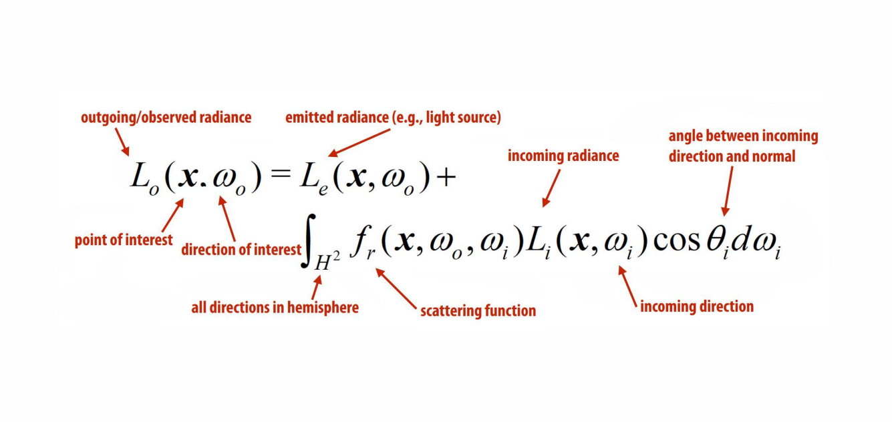
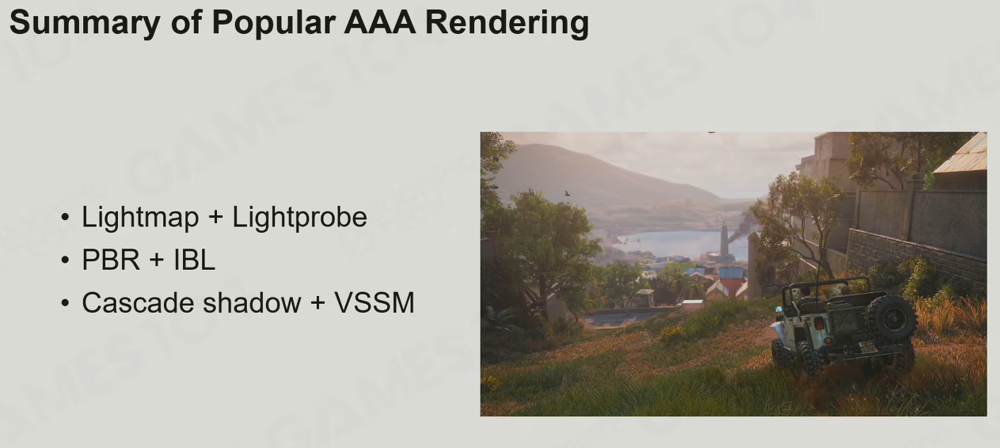
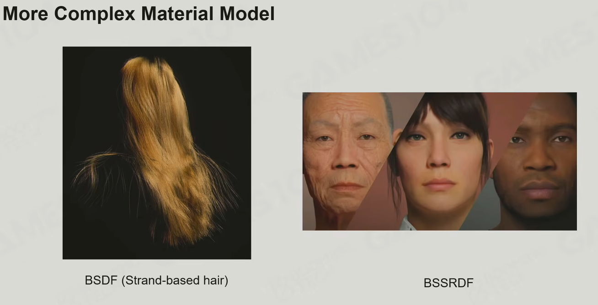

### 渲染方程

1. 渲染方程

   

   - 渲染方程的三个挑战
      - 光源问题：如何获取各个方向的inrandiance

      - 积分问题：半球上的光照和散射积分运算量大

      - 反射出来的光，继续作为其他物体的光源，需要迭代计算渲染方程

2. BRDF 双向反射分布函数

   - 直接光、间接光、反射、折射、散射

3. 渲染的挑战

   - 光的可见性
   - 光源的复杂性 -  点光源、面光源、光源光和材质的相互作用
   - 全局光照-所有的物质都是光源；To evaluate incoming radiance, we have to compute yet another integral, i.e. rendering equation is recursive

4. 辐射度量学

   - radiance  
   - inradiance

5. 最简单的光照方案

   - ambient light
   - domain light
   - cube map reflection 环境贴图

6. blinn-phong 模型

   - ambient+diffuse+specular

   - 缺点：

     - 能量不守恒
     - 渲染的东西像塑料

     

7. 阴影

   - ShadowMap：从光源视角渲染一个场景的shadow map，再计算从相机视角看到的frag到光源的距离（转换到光源坐标系），距离大于shadow map，则为阴影；
   - ShadowMap存在的问题：
     - 采样率不同的问题：从光源渲染的Shadow Map和从相机视角渲染的世界的采样率是不一样的，信号的采样率不一致，一定会导致artifacts; 透视投影导致相机近处 Shadow Map 采样率不足，远处ShadowMap采样过度；
     - 自遮挡的问题：光源渲染shadow map的采样率和相机渲染场景的采样率不一样引起；一般需要提升shadowMap分别率或depth精度；
   - biais

8. 全局光照

   - 全局光照=直接光照+间接光照
   - 间接光照如何表达
   - Light Map
   - 光照探针(light probes)
   - 反射探针(reflection probes)

9. 傅里叶变换与Spherical harmonics

   - Spherical Harmonics, a mathematical system analogous to the Fourier transform but defined across 

     the surface of a sphere. The SH functions in general are defined on imaginary numbers

     

10. 基于物理的材质

    - 微平面

      - 影响法线分布
      - 影响自遮挡
    - 菲涅尔方程（fresnel equation）

      - 反射角约接近掠角，反射越强
    - PBR模型

      - Specular Glossiness：镜面反射-光泽度

        - Base Collor = Diffuse(漫反射贴图)
        - Specular:镜面反射
        - Glossiness：光泽度
        - 辅助纹理：Normal Map、Ambient Occlusion、Height Map、Emissive
      - Metallic Roughness：金属度-粗糙度
      
        - Base Color = Albedo(反照率贴图)
        - Metallic：
          - 控制BaseColor的解读
          - 驱动菲涅尔反射：0 菲涅尔反射为0.02-0.05 ，1 菲涅尔反射为0.7-1,0-1插值
          - 控制漫反射：0有漫反射，1没有漫反射，0-1插值
        - Roughness:微表面的不规则程度
        - 辅助纹理：Normal Map、Ambient Occlusion、Height Map、Emissive
      - 优先选用Metallic Roughness模型，两种PBR模型可以相互转换
      - Diffuse/Albedo区别
      
        - Diffuse：可包含非物理信息，遗留术语
        - Albedo: 物理准确的表面反射率（0-1），不带非光照信息

11. IBL Image Based Lighting：预处理环境光贴图

12. Shadow

    - Hard Shadow

    - Cascade Shadow:原理是**将视锥体（Camera Frustum）分割成多个距离区间（层/级联），并为每个区间独立生成一张阴影贴图**。

    - Soft Shadow
      - PCF:Percentage Close Filter

      - PCSS:Percentage Closer Soft Shadow

      - Variance Soft Shadow Map

13. AAA Rendering 

    

14. 人物真实感渲染

    

15. 