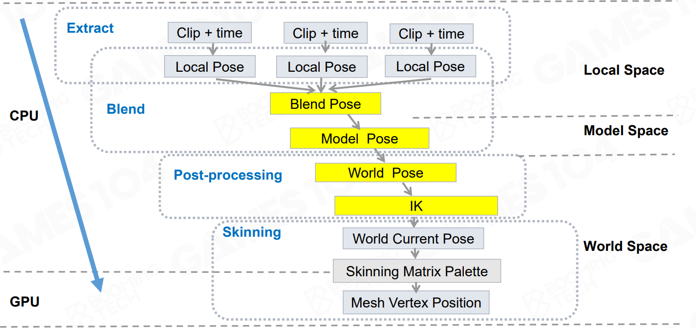

### 游戏动画的挑战

1. 动态交互反馈、与gameplay系统的协作、适配环境；
2. 实时性：实时计算、大量动画数据（从硬盘到内存、Cache）；[动画压缩]
3. 真实性：
   - 动画混合（Motion Matching）
   - 基于物理的动画 （RagDoll、物理模拟）
   - 表情动画 

​		**虚拟人最核心的是动画技术**

### 一、基础动画技术

1. 2D动画

   - 序列帧循环实现动画

   - 增加控制点控制变形

2. 3D动画

   - 自由度 Degree of FreeDom（DOF）：前后、左右、上下、yaw、roll、pitch

     

   - 刚体层级动画：父子节点

   - 顶点动画：存储每个顶点每帧的位置、法线朝向；

     

   - Morph Target Animation（BlendShape）: 带权重的顶点动画； 

3. 蒙皮动画实现

   

   - 优势

     - 相对于顶点动画，数据量小
     - 相对于刚体层级动画，不会相互穿插

   - Local Space ： 每个骨骼的坐标系；世界坐标系-模型坐标系-局部坐标系

     

   - Joint vs Bone

     -  The joints are the objects directly manipulated by the animator to control motion
     -  The bones are the empty space between the joints

   - 特殊关节点

     - **Root joint**
       - The center of the feet
       - Convenient to touch the ground
     - **Pelvis joint**
       - The first child joint of the root joint
       - Human upper and lower body separation
     - **Mount joint**
       - 两个骨架的mount Joint绑定在一起，坐标轴完全重合，平移、旋转都完全一致

   - T-Pose vs A-Pose

     - T-Pose的肩膀部分mesh被挤压，导致做动作时可能精度不够

4. 动画压缩

   - scale\translation 基本不变，主要是rotation变化；
   - rotation 提取关键帧处的数据，节省数据，中间用插值算法计算；
   - catmull spline曲线插值
   - 对存储的平移旋转缩放 不使用float，也进行压缩；

5. Animation Content Creation 动画生产管线

   - Animation DCC(Digital Content Creation)
   - Motion Capture

6. 3D 旋转

   - 欧拉角 yaw\roll\pitch

   - 欧拉角表征三维旋转的问题

     - 顺序依赖，不同旋转顺序，结果不同

       

     - 万向节

       - 万向节是提供旋转三个自由度的保持平衡的装置

       - 万向节死锁 **Gimbal** **Lock**：xyz三个轴中两个轴旋转到共轴

     - 难以插值，用四元数

     - 难以组合旋转

     - 难以做定轴运算

     - 优点是符合人的认知

   - 四元数·

     - 定义

       $$
       q=a+bi+cj+dk\\
       i^2=j^2=k^2=ijk=-1\\
       k^2=-1 ==> k = -1/k ==> k = ijk/k ==>ij=k
       $$
       
     - 只有在三维空间有效，用群论证明5
     
       

### 二、高级动画技术

1. 动画变形

   - Skinning Matrix 蒙皮矩阵
   - 逆绑定矩阵
   - 顶点的位置：模型矩阵 * 关节矩阵 * 逆绑定矩阵

   

   - 旋转角度的插值

     - 线性插值（位移和缩放可以直接用线性插值，旋转不能用线性插值）

     - N-Lerp ：对两个点的位置插值得到插值点，再除以长度，线性插值+Normalization，旋转用N-lerp；

       

     - N-Lerp的最短路径插值：两个向量的点乘是否大于0，

       - 大于0直接插值

       - 小于0则大于180度，反向插值；

       

     - S-Lerp : 对角度进行插值

     - N-Lerp & S-Lerp
     
       
     
     

2. 动画Runtime Pipeline

   

   

3. 基于物理的动画

   1. 衣料、水体模拟
   2. Inverse Kinematics(IK)：反向动力学

4. 动画管线

5. Animation Graph

6. 面部动画

   - FACS 46种表情单元 、28个core Action Units;
   - 真实的存AU时，只存局部mesh;

7. 动画重定向

   - 采集一套动作，应用到不同体型的角色上
   - 骨骼结构不一致时的重定向
     - 忽略一部分
     - 做插值
   - 角色的自穿插问题

8. 表情动画的重定向

### 高级动画

1. Animation Blending ：

   - 两或多个动画clip之间进行lerp插值，实现无极动画;
   - 权重计算：使用实际参数计算权重；例如走跑混合，使用速度参数计算权重；
   - 混合的动画最好是循环动画；
   - 须实现动画归一化时间的对齐；

2. Blend Space

   - 1D Blend Space : 基于一个输入数据进行混合

   - 2D Blend Space : 基于两个输入数据混合，delauney 三角刨分

     

3. Masked Blending ：局部Blending， eg:上下半身的混合

4. Additive Blending : 在clip的基础上，对部分关节加一个修饰量、偏移量， eg : 指定头的朝向

5. Animation State Machine (ASM)  动画状态机

   - 状态包含多个node，node 可以是clip，也可以是blend space；
   - 状态之间进行切换，需要过渡；

   

6. 动画过渡 ：Cross Fades 

   - 冻结过渡：动画1停住，动画2的权重在duration范围内从0升到1
   - 平滑过渡：duration时间范围内，动画1权重1->0,动画2权重0->1;
   - 过渡曲线：最常用：线性、ease-in\ease-out;

   

7. Animation Blend Tree 动画混合树

   ##### 利用混合参数作为输入，通过数学插值（加权平均）的方法，实时计算并融合多个动画片段中骨骼的变换信息（位置、旋转），输出一个连续平滑变化的最终骨骼姿势。

   - Terminal node (Leaf Nodes)
     - Clip
     - Blend Space 
     - ASM 
   - Non-terminal node (No-Leaf Nodes) 
     - Binary LERP blend node
     - Ternary (triangular) LERP blend node 
     - Binary additive blend node

8. IK 反向动力学 ： 动画的后处理

   - Two Bone IK：三个关节点，中间关节点位置计算可能有多个解，需要指定一个参照方向（reference vector）解决该问题；

   - Look At IK

   - Foot IK

   - Multi-Joint IK  长链IK的不唯一解问题；

     - 对关节活动范围进行限制 constraints

       

     - **CCD(Cyclic Coordinate Decent) 循环坐标下降**：从末端节点（末端效果器 end effector）到根节点逐个尝试向目标位置旋转；

       - Principle:From joint-to-joint, rotates the end-effector as close as possible to the target, solves IK problem in orientation space 
       - Reachability：Algorithm can stop after certain number of iterations to avoid unreachable target problem 
       - Contraints：Angular limits is allowed, by checking after each iteration
     - Optimized CCD
     - FABRIK (Forward And Backward Reaching Inverse Kinematics) 

       - 末端节点先直接移动到目标位置，保持骨骼长度不变，造成次末端节点发生位移
       - 依次对各节点进行位移，直到root节点
       - 再反过来对root节点移回原位置，直到末端节点
       - 反复多次执行上述步骤；
     - jacobe matrix（雅可比矩阵）: 解决多个末端效果器的IK问题

9. Morph Target Animation

   - Facial Action Coding System (FACS) 定义了46个面部表情单元
   - 46个面部表情单元中，提取出28个核心面部表情单元
   - morph target 实际存储了每个表情的**局部顶点区域与中性脸该区域**顶点的**偏移**数据：Create AU key poses only store vertexes different from the neutral pose (Additive Blending)

10. 动画重定向

    - Ignore Offset Between Source and Target Joints
    - Keep Orientation in Different Binding Pose
    - 重定向后，应用动画时，使用的是相对binding pose的各关节的旋转，而不是各关节local pose 绝对的旋转；
      - 动画数据存储时，可能存储相对bingding Pose 的旋转，也可能存储local pose 下绝对的旋转；
    - 重定向的两个骨骼差别相对大时，可以增加IK辅助调整效果；
    - morgh target 重定向
      - 不同人脸拓扑结构须一致；基于标准脸重建各人物脸；
      - 不同人脸眼睛大小不一致时，导致的不能闭合或者过度闭合问题，可以用拉普拉斯变形解决；

11. 