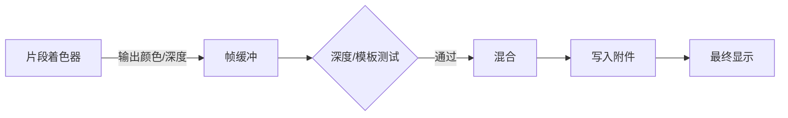
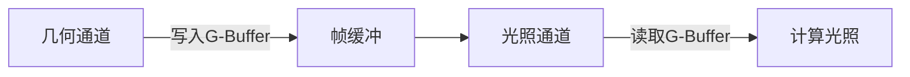

### 零、OpenGL 帧缓冲学习

1. 渲染到一个不同的帧缓冲被叫做离屏渲染(Off-screen Rendering)。
2. 附件类型

   - 纹理附件：优点是，所有渲染操作的结果将会被储存在一个纹理图像中，我们之后可以在着色器中很方便地使用它；
   - 渲染缓冲对象附件：
   
     - 将数据储存为OpenGL原生的渲染格式，直接将所有的渲染数据储存到它的缓冲中，不会做任何针对纹理格式的转换；
     - 渲染缓冲对象设计为只写，但提供有限读取能力，可以使用glReadPixels来读取，不能使用纹理采样读取；


在图形渲染管线中，**帧缓冲（Framebuffer）** 是承载渲染结果的最终容器，也是连接GPU与屏幕的核心枢纽。以下是其核心原理与关键技术的深度解析：

---

### 一、帧缓冲的本质
**帧缓冲是一个逻辑对象**，它本身不存储数据，而是**组织多个附件（Attachments）** 的容器：


```c
struct Framebuffer {
    ColorAttachment[0..N] : Renderbuffer/Texture,  // 颜色附件
    DepthAttachment       : Renderbuffer/Texture,  // 深度附件
    StencilAttachment     : Renderbuffer/Texture   // 模板附件
    DepthStencilAttachment : Renderbuffer/Texture // 深度模板附件
};
```
> 📌 **关键特性**：  
> - **附件动态绑定**：可随时切换纹理或渲染缓冲对象（RBO）  
> - **Texture**：纹理图像，方便着色器中直接使用
> - **RenderBuffer** : opengl原生渲染格式 ，性能高
> - **多渲染目标（MRT）**：支持同时输出到多个颜色附件（如延迟渲染）

---

### 二、帧缓冲在渲染管线中的位置

1. **输入**：片段着色器的输出值（`gl_FragColor`、`gl_FragDepth`）
2. **处理**：深度测试 → 模板测试 → 混合计算
3. **输出**：修改附件的像素数据

---

### 三、核心附件类型及功能
#### 1. **颜色附件（Color Attachment）**
- **存储内容**：RGB/A颜色值（8/16/32位格式）
- **核心用途**：
  
  - 主颜色输出（最终显示）
  - 存储中间结果（如G-Buffer）
- **OpenGL 操作**：
  
  ```c
  glFramebufferTexture2D(GL_FRAMEBUFFER, GL_COLOR_ATTACHMENT0, 
                         GL_TEXTURE_2D, colorTex, 0);
  ```

#### 2. **深度附件（Depth Attachment）**
- **存储内容**：Z-Buffer（24/32位浮点）
- **深度测试规则**：
  ```python
  if fragment.z < depth_buffer[x][y]:  # 默认GL_LESS
      write_to_buffer()
  else:
      discard_fragment()
  ```
- **硬件优化**：Early-Z（在片段着色器前测试）

#### 3. **模板附件（Stencil Attachment）**
- **存储内容**：8位整数掩码
- **典型工作流**：
  ```c
  glStencilFunc(GL_EQUAL, 1, 0xFF);  // 仅当模板值=1时通过
  glStencilOp(GL_KEEP, GL_INCR, GL_DECR); // 根据测试结果修改值
  ```
- **应用场景**：轮廓描边、体积光门户剔除

#### 4. **深度-模板组合附件**
- **格式**：`GL_DEPTH24_STENCIL8`
- **OpenGL绑定**：
  ```c
  glFramebufferTexture2D(GL_FRAMEBUFFER, GL_DEPTH_STENCIL_ATTACHMENT,
                         GL_TEXTURE_2D, depthStencilTex, 0);
  ```

---

### 四、帧缓冲的三大使用模式
#### 1. **默认帧缓冲（Default Framebuffer）**
- **绑定ID**：`0`
- **特性**：
  - 由窗口系统创建（如GLFW）
  - 附件不可修改，直接链接到屏幕
- **交换缓冲**：`glfwSwapBuffers(window)`

#### 2. **离屏渲染帧缓冲（FBO）**
- **创建流程**：
  ```c
  GLuint fbo;
  glGenFramebuffers(1, &fbo);       // 创建FBO
  glBindFramebuffer(GL_FRAMEBUFFER, fbo); // 绑定
  
  // 绑定颜色附件纹理
  glFramebufferTexture2D(GL_FRAMEBUFFER, GL_COLOR_ATTACHMENT0, 
                         GL_TEXTURE_2D, tex, 0);
  
  glCheckFramebufferStatus(GL_FRAMEBUFFER); // 检查完整性
  ```
- **应用场景**：
  - 后期处理（先渲染到FBO，再全屏绘制）
  - 阴影贴图生成
  - 环境反射捕捉

#### 3. **多重采样帧缓冲（MSAA）**
- **抗锯齿原理**：
  ```mermaid
  graph TB
  A[渲染到MSAA FBO] --> B[解析到普通纹理]
  B --> C[屏幕绘制]
  ```
- **OpenGL实现**：
  ```c
  // 创建MSAA颜色附件
  glTexImage2DMultisample(GL_TEXTURE_2D_MULTISAMPLE, samples, 
                         GL_RGB, width, height, GL_TRUE);
  
  // 解析到单采样纹理
  glBlitFramebuffer(0,0,w,h, 0,0,w,h, 
                   GL_COLOR_BUFFER_BIT, GL_LINEAR);
  ```

---

### 五、帧缓冲的完整工作流程
#### 1. **渲染前配置**
```c
glBindFramebuffer(GL_FRAMEBUFFER, fbo);  // 绑定FBO

// 指定可写的颜色附件
GLuint attachments[3] = {GL_COLOR_ATTACHMENT0, 
                        GL_COLOR_ATTACHMENT1,
                        GL_COLOR_ATTACHMENT2};
glDrawBuffers(3, attachments);

// 清除附件
glClear(GL_COLOR_BUFFER_BIT | GL_DEPTH_BUFFER_BIT);
```

#### 2. **渲染中操作**
- 深度测试：`glEnable(GL_DEPTH_TEST)`
- 模板操作：`glStencilMask(0xFF)`
- 混合设置：`glBlendFunc(GL_SRC_ALPHA, GL_ONE_MINUS_SRC_ALPHA)`

#### 3. **渲染后处理**
```c
// 解绑FBO（切回默认缓冲）
glBindFramebuffer(GL_FRAMEBUFFER, 0); 

// 将FBO纹理绘制到屏幕
glBindTexture(GL_TEXTURE_2D, fbo_texture);
renderFullscreenQuad();
```

---

### 六、高级应用技术
#### 1. **延迟渲染（Deferred Shading）**

- **G-Buffer典型附件**：
  - Attachment0: RGB - 漫反射, A - 高光强度
  - Attachment1: XYZ - 世界法线
  - Attachment2: R - 金属度, G - 粗糙度, B - AO

#### 2. **HDR渲染管线**
- **颜色附件格式**：`GL_RGBA16F`
- **流程**：
  
  ```mermaid
  graph LR
  A[渲染到HDR FBO] --> B[色调映射] 
  B --> C[输出到LDR默认缓冲]
  ```

#### 3. **动态反射探针**
```c
// 创建立方体贴图FBO
glFramebufferTexture(GL_FRAMEBUFFER, GL_COLOR_ATTACHMENT0, 
                    cubeMapTex, 0, face_index);
```

---

### 七、性能优化要点
| **技术**         | **原理**                        | **OpenGL API**                |
| ---------------- | ------------------------------- | ----------------------------- |
| **附件懒加载**   | 不使用的附件设为 `GL_NONE`      | `glDrawBuffers(0, {GL_NONE})` |
| **渲染目标压缩** | 使用 FBO 压缩格式（如 DXT/ETC） | `GL_COMPRESSED_RGBA`          |
| **分层渲染**     | 一次性渲染到纹理数组不同层      | `glFramebufferTextureLayer()` |
| **内存带宽优化** | 禁用不需要的附件写入            | `glColorMask(GL_FALSE, ...)`  |

---

### 八、帧缓冲完整性检查
**必须验证状态**：
```c
if(glCheckFramebufferStatus(GL_FRAMEBUFFER) != GL_FRAMEBUFFER_COMPLETE) {
    // 常见错误：
    // - 附件尺寸不一致
    // - 未绑定任何颜色附件
    // - 格式不支持
}
```

---

### 总结：帧缓冲的三大核心角色
1. **渲染目标管理器**  
   协调颜色/深度/模板附件的读写操作
2. **离屏渲染引擎**  
   实现后期处理、阴影、反射等高级效果
3. **硬件资源接口**  
   桥接GPU内存（纹理/RBO）与渲染管线输出

掌握帧缓冲技术，意味着解锁了现代图形编程的核心能力——从基础渲染到电影级特效，其设计直接影响渲染性能与效果上限。