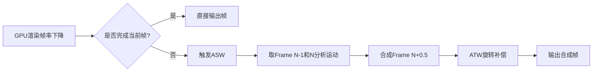

ASW（**异步空间扭曲**，Asynchronous Spacewarp）是Oculus（Meta）开发的一种**高级帧率补偿技术**，用于在VR中当GPU无法及时渲染完整帧时，通过**智能合成中间帧**来维持流畅体验。它本质上是ATW（异步时间扭曲）的**超集**，不仅修正头部旋转，还能处理**复杂场景运动**（平移、物体移动等）。

---

### **ASW核心原理**
#### **1. 核心目标**
- **问题**：当GPU渲染帧率低于头显刷新率（如90Hz）时，传统ATW只能修正旋转，无法处理平移或物体运动导致的画面断裂。
- **解决方案**：ASW基于**前两帧的历史数据** + **实时运动分析**，动态生成中间帧;  (n-1 + n  -->  n+1)

#### **2. 关键步骤**
##### **步骤1：运动向量分析（Motion Vector Estimation）**
- **输入**：  
  
  - 前一帧（Frame N-1）的颜色/深度缓冲区  
  - 当前帧（Frame N）的颜色/深度缓冲区（已渲染完成的部分）
- **过程**：  
  通过**光流法（Optical Flow）** 或 **GPU运动估计单元**，计算每个像素从Frame N-1到Frame N的**运动向量（Motion Vector）**，形成全屏运动场。  
  
  ```math
  \vec{V}(x,y) = (dx, dy) = \text{MotionVector}(I_{t-1}, I_t)
  ```

##### **步骤2：运动预测（Motion Prediction）**
- 根据历史运动向量，预测下一时刻（Frame N+1）每个像素的**预期位置**。  
  - 简单模型：匀速运动假设 $\vec{V}_{t+1} = \vec{V}_t$  
  - 高级模型：加速度补偿（如Oculus的AI预测器）。

##### **步骤3：中间帧合成（Frame Interpolation）**
- **输入**：  
  - Frame N（最新完整帧）  
  - 预测的运动向量场V_pred
  - 当前头部姿态（含旋转+平移）
- **合成逻辑**：  
  对每个像素，将其从Frame N的位置沿 **预测向量V_pred** 反方向移动一半时间步长，生成中间帧（Frame N+0.5）的像素值：  
  $$
  I_{t+0.5}(x,y) = I_t(x - \frac{1}{2}dx, y - \frac{1}{2}dy)
  $$
  **ASW并非生成“当前帧”，而是为“即将显示的帧时刻”生成一帧补偿画面**。其本质是：**用已渲染的旧帧（N-1和N），为未来显示时刻合成一帧新画面（N+0.5）**
  
  1. **理想情况（无延迟）**：
     - **时刻T**：显示器刷新，应显示**帧N**（基于T时刻头部姿态渲染）
     - **现实**：GPU渲染延迟，帧N未完成！
  2. **ASW介入时刻**：
     - 在**时刻T**到来时，检测到帧N未完成 → 立即启动ASW
     - **可用数据**：
       - **帧N-1**：已在T-1时刻显示过（旧画面）
       - **帧N**：已渲染部分画面（通常>50%）
  3. **合成目标**：
     - 显示器在**下一刷新时刻T+1**需要新画面
     - ASW需生成**帧N+0.5**（在时间轴上介于帧N与帧N+1之间）

##### **步骤4：空洞填补与后处理**
- **空洞产生**：  
  运动导致遮挡/暴露区域（如物体边缘）出现未覆盖像素。
- **填补技术**：  
  - **深度感知克隆（Depth-Aware Cloning）**：优先从同深度区域复制纹理。  
  - **时域滤波（Temporal Filtering）**：混合前几帧数据减少闪烁。  
  - **边缘感知插值（Edge-Aware Inpainting）**：保护物体边界。

#### **3. 与ATW的协同工作**


---

### **ASW vs ATW 核心差异**
| **特性**       | **ATW**                      | **ASW**                       |
| -------------- | ---------------------------- | ----------------------------- |
| **补偿维度**   | 仅头部旋转                   | 旋转+平移+物体运动            |
| **输入帧需求** | 1帧（前一帧）                | 2帧（前两帧）                 |
| **运动处理**   | 无场景运动补偿               | 全屏光流运动分析              |
| **适用帧率**   | 接近目标帧率（如80fps→90Hz） | 帧率骤降（45fps→90Hz）        |
| **GPU开销**    | 极低（≈1ms）                 | 较高（3-5ms，依赖光流加速器） |
| **伪影类型**   | 静态空洞/旋转扭曲            | 动态物体拖影/运动模糊         |

---

### **ASW的局限性与应对**
1. **动态物体伪影**  
   - **问题**：快速移动物体（如挥动的手）在合成帧中可能出现“幽灵拖影”。  
   - **优化**：  
     - 动态对象遮罩（通过深度/ID缓冲区标记移动物体）  
     - 局部禁用ASW，改用ATW（牺牲运动平滑保清晰度）。

2. **光流计算误差**  
   - **问题**：纹理重复区域（如草地）运动向量计算失败。  
   - **优化**：  
     - 结合深度信息约束光流解算  
     - AI增强的运动估计（Meta Quest Pro的**深度学习运动向量**）。

3. **延迟敏感性**  
   - **问题**：合成依赖最新姿态，但计算需时间（≈3ms）。  
   - **优化**：  
     - 姿态预测（外推未来2-3ms头部位置）  
     - 硬件光流加速（高通Adreno GPU专用单元）。

---

### **工程实现关键**
- **硬件依赖**：  
  需GPU支持**硬件光流**（如高通Snapdragon XR2的“Adreno Motion Engine”）。
- **数据管道**：  
  ```c
  // 伪代码：ASW核心逻辑
  if (!IsFrameReady()) {
      MotionVectorField mv = CalculateOpticalFlow(PrevFrame, CurrentFrame);
      Frame syntheticFrame = SynthesizeFrame(CurrentFrame, mv * 0.5);
      ApplyATW(syntheticFrame, CurrentHeadPose); // 旋转补偿
      FillHolesWithInpainting(syntheticFrame);
      OutputFrame(syntheticFrame);
  }
  ```
- **开发者控制**：  
  通过OVRPlugin可设置`AppSpaceWarp`模式，或手动标记动态物体（如`OVR_LAYER_FLAG_MOTION_BLUR`）。

---

### **ASW的实际价值**
- **性能救星**：允许GPU渲染帧率**降至一半**（如90Hz头显只需45fps）仍保持流畅。  
- **能效优化**：移动VR设备（Quest系列）续航提升30%+。  
- **体验保障**：避免帧率波动时的眩晕感，是VR内容开发的“安全网”。

> 📌 **典型案例**：Meta Quest 2运行《生化危机4 VR》时，ASW将帧率从90fps降至45fps，GPU功耗降低40%，玩家几乎感知不到画质损失。

---

### **总结**
ASW通过**光流运动分析** + **时域帧合成**，将ATW的“旋转补偿”升级为“全场景运动补偿”。其本质是：  
1. **抓取运动趋势**（分析前后帧像素位移）  
2. **预测中间状态**（按时间插值生成虚拟帧）  
3. **智能修补漏洞**（深度感知的空洞填充）  

尽管存在运动伪影局限，它仍是当前移动VR中**平衡画质、性能与延迟的终极武器**。随着AI与硬件光流的进化，ASW正从“帧率急救术”发展为VR渲染管线的**核心组件**。