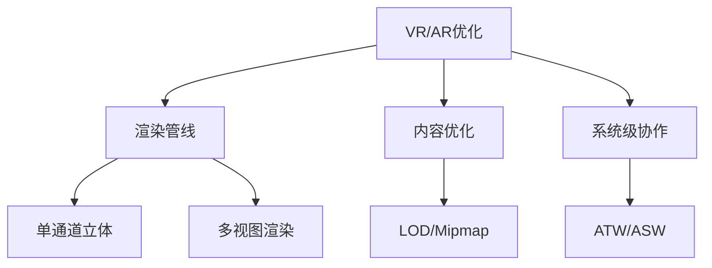
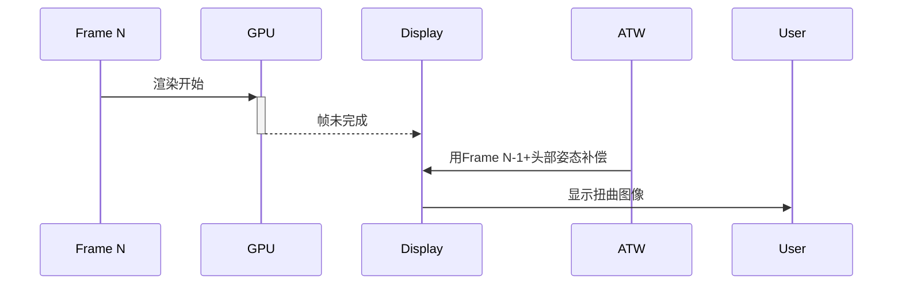
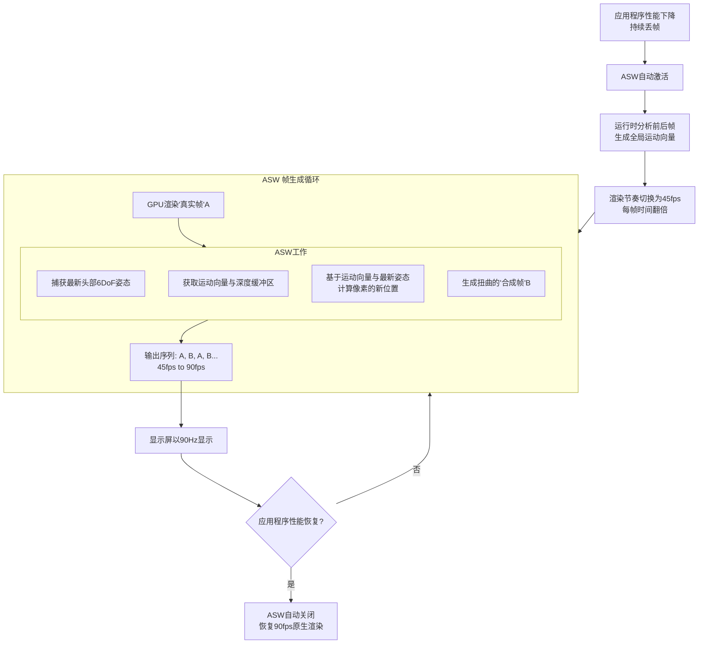
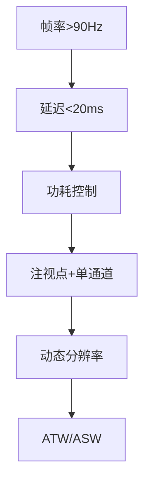

在VR/AR设备上进行渲染需克服**高分辨率（单眼2K+）、超高帧率（72-120Hz）和低延迟（<20ms）**三大挑战。以下是工业级优化技术全解析：

---

### 一、核心优化框架


---

### 二、渲染管线优化技术
#### 1. **单通道立体渲染（Single Pass Stereo）**
- **原理**：**单次几何处理，双重视图输出**，**特指**为**立体显示（VR/AR/3D）**渲染**两个特定视图**（通常是左右眼）进行优化的技术。它是多视图渲染的一个**子集**或**特例**。

  ```mermaid
  flowchart LR
      A[顶点处理] -->|单次执行| B[几何扩增]
      B --> C[分离光栅化]
      C --> D[左眼管线]
      C --> E[右眼管线]
      D --> F[独立深度测试]
      E --> G[独立深度测试]
      D --> H[共享材质计算]
      E --> H
      H --> I[视图相关后处理]
  ```

  

- CPU的顶点数据绑定、渲染状态设置、Draw Call 是复用的；
  
- **顶点着色器独立进行**：每个相机有独立的观察矩阵、投影矩阵
  
- **光栅化独立进行**：独立计算每个顶点屏幕空间位置，独立进行图元设置、遍历

- **深度测试独立进行** → 每个view进行独立深度测试，保证正确遮挡

- **片段着色部分共享** 

  - 材质计算，光照计算与视图无关，可以复用；
  - 屏幕空间效果（基于当前视图的屏幕坐标）独立；

- **视图依赖处理分支化** → 增加少量ALU开销

- 与两次前向渲染对比

  | 操作          | 主机前向渲染 | VR单通道         | 优化比 |
  | :------------ | :----------- | :--------------- | :----- |
  | Draw Call提交 | O(2N)        | **O(N)**         | 50%↓   |
  | 状态切换      | 2×材质绑定   | 1×材质绑定       | 50%↓   |
  | 矩阵上传      | 2×MVP        | **1×MVP+眼偏移** | 40%↓   |

- **收益**：共享几何、材质数据，其余过程基本独立计算； 避免了为每个视图重复提交相同的几何数据和渲染状态；CPU开销降低40%，Draw Call减少50%

#### 2. **多视图渲染（Multiview Rendering）**

​		是一个**更广泛、更通用**的概念。它指的是在一次渲染通道中渲染**任意数量**的视图（两个或更多）。这些视图可以是：

- 立体渲染的左右眼视图（即单通道立体渲染是其应用）。
- 立方体贴图的多个面（正面、背面、左面、右面、顶面、底面）。
- 同时渲染到多个视口或渲染目标（如分屏显示、多屏输出、阴影图阵列渲染）。
- 基于图像的渲染技术中的多个参考视图。

### 三、内容优化技术
#### 1. **注视点渲染（Foveated Rendering）**

- 原理：**只为用户视线聚焦的中心区域（注视点）提供高分辨率渲染，而对视野边缘区域进行低分辨率渲染或简化处理**；人眼视网膜中间视锥细胞密度高，因此只在视线聚焦的中心区域（大约2°视角范围）具有**极高的分辨率和色彩敏感度**；

- 注视点渲染的核心思想就是**模拟人眼的这种特性**：
  - **高分辨率区域 (Foveal Region):** 围绕用户当前的注视点（由眼动追踪确定）渲染最高分辨率（如原生分辨率）。
  - **中等分辨率区域 (Para-foveal Region):** 围绕高分辨率区域的环形区域，渲染中等分辨率（如1/2或1/4原生分辨率）。
  - **低分辨率区域 (Peripheral Region):** 视野的最外围区域，渲染最低分辨率（如1/8或更低原生分辨率），甚至进行更激进的简化（如降低几何复杂度、简化着色计算、跳过某些后期特效）。
  - 不同分辨率区域之间需要平滑过渡（通常使用**渐变滤镜/遮罩**），以避免出现明显的边界伪影（“分辨率环”）

- 依赖技术
  - **高精度、低延迟（< 5ms）的眼动追踪**
  - **动态分辨率渲染管线** 
    - **可变速率着色（Variable Rate Shading, VRS）**：
      - 这是现代GPU（如NVIDIA Turing架构、AMD RDNA2架构及之后的GPU）支持的一种硬件特性，是高效实现注视点渲染的关键。
      - **传统渲染**：每个像素单独执行一次着色器程序（每像素着色，Per-Pixel Shading）。
      - **VRS**：允许开发者指定一个“着色速率”（Shading Rate）。例如，可以指定一个2x2的像素块只执行一次着色器计算，然后将结果复用于这4个像素。这大大减少了着色器调用的次数。
      - **结合注视点渲染**：可以为高精度区设置1x1的着色速率（即每像素着色），为中环区域设置2x2的着色速率，为外环设置4x4甚至更低的着色速率。VRS由GPU硬件直接支持，效率极高，是实现多层渲染的理想方式。
      - 时机：在片段着色器开始之前，光栅化阶段之后，GPU会**查询着色速率纹理（SRI）**。根据查询结果，GPU会决定如何执行着色；
    - **多级渲染目标与合成 (Multi-Render Target & Compositing):** 
      - 将场景渲染到多个不同分辨率的缓冲区，然后根据注视点位置和区域遮罩合成到最终的帧缓冲。
      - 需要在不同区域的边界处进行**滤波（Filtering）** 或 **上采样（Upscaling）**，使用如高斯模糊等技巧进行平滑过渡，使分辨率的变化不被用户感知。

- ##### 流程图

  ```mermaid
  flowchart TD
  A[CPU端: 每帧开始] --> B[眼球追踪传感器<br>获取原始数据]
  B --> C[眼球追踪算法<br>屏幕空间注视点坐标]
  C --> D[配置可变速率着色VRS<br>生成着色速率图SRI]
  
  D --> E
  
  subgraph E[GPU渲染管线]
      direction TB
      F[顶点着色器<br>及后续几何阶段] --> G[投影与光栅化]
      G --> H{查询着色速率图SRI}
      H -- 根据SRI决定<br>着色频率 --> I[片段着色器<br>核心节省算力阶段]
  end
  
  I --> J[后处理<br>可选: 边界滤波过渡]
  J --> K[输出最终图像]
  ```

  

- **数据压缩**：

  | 区域 | FOV   | 分辨率比例 | 像素减少 |
  | ---- | ----- | ---------- | -------- |
  | 中心 | 0-3度 | 100%       | -        |
  | 中间 | 3-7度 | 50%        | 75%      |
  | 边缘 | >7度  | 25%        | 94%      |

### 2.动态分别率**（Dynamic Resolution Scaling, DRS）**

1. 原理：将上一帧的实际耗时与**目标帧时间**（例如 11.1ms for 90Hz）进行比较。

   - **如果实际耗时 > 目标时间**： 说明GPU负载过高，下一帧需要**降低渲染分辨率**以减轻负担。
   - **如果实际耗时 < 目标时间**： 说明GPU尚有冗余算力，下一帧可以**提高渲染分辨率**以提升画质。

2. ##### 关键技术细节与挑战

   实现一个高效好用的DRS并非简单地缩放分辨率，需要考虑以下细节：

   #### 1. 分辨率调整策略

   - **如何变化？** 分辨率通常不是连续变化的，而是基于一个预设的**分辨率等级列表**（如 100%, 90%, 80%, 70% of native）。这避免了频繁创建和销毁纹理资源。
   - **变化幅度？** 变化幅度通常与“超出目标时间的程度”成比例。轻微超时就小幅下调，严重超时就大幅下调。

   #### 2. 图像缩放 (Upscaling) 与锐化 (Sharpening)

   降低分辨率渲染后，最终输出到头显屏幕的图像需要被**拉升（Upscale）** 到原生分辨率。简单的双线性过滤（Bilinear Filtering）会产生模糊感，因此必须配合高质量的**图像缩放算法**：

   - **传统算法**： 双立方（Bicubic）滤波，效果优于双线性。
   - **现代标准**： **AMD FidelityFX Super Resolution (FSR 1)** 或 **NVIDIA Image Scaling (NIS)**。这些是高效的、与硬件无关的空间放大算法，包含一个高效的升采样步骤和一个后续的**锐化（Sharpening）** 通道。锐化至关重要，它可以有效减轻放大后的模糊感，恢复细节和边缘。
   - **AI方案**： 如DLSS，但需要特定硬件（Tensor Cores），在XR中应用较少。

   #### 3. 平滑过渡与迟滞 (Hysteresis)

   - **抖动问题**： 如果分辨率调整过于敏感，会导致分辨率在相邻两帧之间频繁跳动，产生令人不适的“闪烁”或“呼吸”效果。
   - **解决方案**：
     - **平滑处理**： 使用一个**移动平均**或**指数平滑**滤波器来处理分辨率的变化，而不是立即切换到计算出的新值。这能产生平滑的过渡。
     - **迟滞效应**： 设置一个“缓冲区”。例如，从100%降到90%的阈值（如耗时 > 12ms）和从90%升回100%的阈值（如耗时 < 10ms）是不同的。这避免了系统在临界点附近来回震荡。

   #### 4. 性能预测与多帧延迟

   - **延迟问题**： 基于**上一帧**的耗时来调整**当前帧**的分辨率，这存在天然的**一帧延迟**。如果场景负载突然急剧增加（如突然转身看到复杂场景），DRS需要一帧后才能反应，可能导致本帧依然卡顿。
   - **优化方案**： 更先进的系统会尝试**预测**当前帧的复杂度。例如，结合CPU侧的游戏逻辑、摄像机移动速度、可见物体数量等信息进行预测性调整，但实现起来更为复杂。


---

### 四、延迟优化技术
ATW的核心思想：最后一刻的修正

#### 1.延迟优化器：当前帧渲染完成，用渲染完成时刻的Pose信息重投影生成修正帧；

ATW不像传统渲染那样试图加速整个管线，而是采用了一种更聪明、更取巧的方法：

> **先按一个“过时”的姿态正常渲染一整帧，然后在显示前的最后一刻，用“最新”的姿态快速扭曲这帧图像，使其看起来像是用最新姿态渲染的一样。**

它本质上是一种**图像后处理技术**，而不是3D渲染技术。即便在帧率稳定90帧且不掉帧的情况下，也应该开启ATW，ATW可以把延迟从11ms降低到1-2ms，开启不开启，体感差异巨大，尤其是在剧烈摇头的时候；

#### 2. **掉帧拯救者**：当前帧未完成渲染时，用前一帧屏幕信息+头部最新姿态在GPU中极速（1-2ms）重投影生成补偿帧

#### 3.执行流程：



- ##### 补偿帧生成流程 （ASW的重投影过程）

  - 重投影

    - 对**前一帧每个像素**，利用其深度值（Depth）还原到3D世界坐标（视图重投影）

    - 根据 **“当前头部姿态” vs “前一帧头部姿态”** 的差异，计算该3D点在新视角下的屏幕坐标：

      ```
      新屏幕坐标 = 当前投影矩阵 × 当前视图矩阵 × 前一帧视图矩阵⁻¹ × 前一帧投影矩阵⁻¹ × 旧屏幕坐标
      ```

    - 将前一帧颜色值映射到新位置。

  - **空洞填补（Hole Filling）**
    重投影后会出现未被覆盖的区域（如新视角暴露的背景），常用填补方法：

    - **深度扩展（Depth Expansion）**：将相邻像素沿深度方向拉伸（适合静态场景）。
    - **拉伸填充（Inpainting）**：复制边缘像素（快速但可能模糊）。
    - **动态对象处理**：动态物体（如手部）需特殊标记避免拉伸扭曲。

  - **时间扭曲（Time Warp）**
    对重投影后的图像应用**旋转扭曲**，修正生成补偿帧期间头部的微小运动（通常用顶点扭曲而非像素级）。
    

- **ATW的工作原理** 

  1. **输入数据**：
     - **颜色缓冲区（Color Buffer）**：这是应用程序渲染的当前帧的图像，基于渲染时的头部姿态（包括位置和旋转）。
     - **最新的头部旋转数据**：在渲染完成后、显示前的最后一刻，ATW从IMU（惯性测量单元）获取最新的头部旋转数据（仅旋转，不包括位置变化）。
  2. **扭曲过程**：
     - ATW计算渲染时头部旋转与最新头部旋转之间的差异（ΔR）。
     - 然后，它对颜色缓冲区中的图像应用一个**2D的旋转扭曲**（通过顶点着色器或全屏着色器）。这个扭曲模拟了旋转变化的效果，使图像看起来像是基于最新旋转姿态渲染的。
     - 扭曲操作是在图像空间（屏幕空间）直接进行的，不需要知道场景的几何或深度信息。因为它只处理全局旋转，整个图像会作为一个整体被扭曲，而不考虑像素的深度。
  3. **为什么不需要深度信息**：
     - **旋转是全局变换**：旋转变化会影响整个图像 uniformly（所有像素以相同方式移动），不需要根据深度调整像素位置。例如，旋转头部会导致整个视野变化，但场景中的物体之间的相对位置不会改变（没有视差效应）。
     - **位置变化未被处理**：ATW故意忽略位置变化，因为位置变化会导致视差（不同深度的物体移动程度不同），而处理视差需要深度信息。ATW的设计目标是低延迟和高效，因此只处理旋转，将位置变化留给其他技术（如ASW）。
     - **图像空间操作**：ATW的扭曲是基于UV坐标的变换，而不是3D重投影。它使用一个预计算的畸变网格或着色器来移动像素，这些操作只依赖旋转矩阵，不需要深度缓冲区。

  

##### 	4.缺陷：**它只能完美补偿头部的旋转运动，无法补偿头部的平移运动（Positional Movement）和场景中物体的运动。**

#### 2. **空间扭曲（ASW）**

#### **ASW**（**异步空间扭曲**，Asynchronous Spacewarp）

​	一种**高级帧率补偿技术**，当GPU无法及时渲染完整帧时，分析上一帧和当前帧的场景运动信息，通过**智能合成中间帧**来维持流畅体验。它本质上是实时的、基于运动向量的帧插值技术，不仅修正头部旋转，还能处理**复杂场景运动**（平移、物体移动等）。

#### 优势：

1. **强大的性能救赎**：允许应用程序帧率下降高达50%（从90fps到45fps）而依然保持视觉流畅，是应对复杂场景和性能波动的终极安全网。
2. **补偿6自由度运动**：完美解决了ATW无法处理的头部平移问题，大幅提升了在空间移动时的视觉稳定性。
3. **处理动态物体**：通过运动向量，能够一定程度上推测场景中运动物体的新位置。

#### 流程：




#### 前提条件：应用程序的合作

要高效运行ASW，需要应用程序在渲染时提供两个关键缓冲区：

1. **深度缓冲区 (Depth Buffer)**：记录每个像素在3D空间中的Z轴深度值。
2. **运动向量缓冲区 (Motion Vectors Buffer)**：记录每个像素从上一帧到当前帧的屏幕空间运动方向和速度。现代游戏引擎（如Unity、Unreal）都支持生成此缓冲区。

#### 步骤 1: 检测与触发

- XR运行时（如Oculus）会持续监控应用程序的帧时间。
- 当它检测到应用程序**连续多次无法在11.1ms（90Hz）内完成渲染**，预测其将无法维持90fps时，便会**自动触发ASW**。

#### 步骤 2: 节奏切换与帧生成

这是ASW最核心的魔法：

- **节奏切换**：运行时通知应用程序：“你不用再拼命跑90fps了，**改为以45fps的节奏渲染吧**”。这意味着每一帧的渲染时间从11.1ms延长到了22.2ms，给了应用程序充足的喘息空间，确保每一帧都能稳定完成。
- **插帧（Frame Interpolation）**：对于显示器来说，它仍然需要90fps的信号输入。于是，ASW承担了生成中间帧的任务：
  - 应用程序渲染出的第N帧（一个完整的、高质量的“真实帧”）。
  - ASW算法会分析这个第N帧以及之前的第N-1帧(两个正常渲染帧)。结合**深度缓冲区**和**运动向量**，ASW可以理解场景中每个像素的运动轨迹和3D位置。
    - 运动向量,存储在屏幕空间缓冲区中，以纹理的形式存在，RG通道存储运动方向和速度；
  - 当需要生成下一帧（即第N+1帧）时，ASW会做两件事：
    1. **捕获最新的头部6-DoF姿态**：在最后一刻获取头显最新的位置和旋转。
    2. **重投影（Reprojection）**：**它不是简单的图像扭曲，而是基于运动向量和深度信息，将第N帧中的每一个像素，根据其运动轨迹和最新的头部姿态，“移动”到它在新一帧中应该出现的位置上**。这个过程类似于视频播放器中的“运动补偿”插帧技术，但更复杂，因为它处理的是6自由度的视角变化。

#### 步骤 3: 合成与输出

- 通过上述过程，ASW生成了一帧新的“合成帧”。这个合成帧是基于真实数据推算出来的，视觉上基本可信。
- 最终，输出到显示器的图像序列就变成了： **A(真实帧) -> A'(ASW合成帧) -> B(真实帧) -> B'(ASW合成帧)...**
- 这样，从显示器的角度看，它依然收到了90fps的帧序列，画面依然是流畅的。用户感知到的性能是90fps，而应用程序实际上只渲染了45fps。

#### 步骤 4: 处理伪影 (Artifact Handling)

ASW的“猜测”不可能100%准确，因此会产生视觉伪影，最常见的是：

- **重影（Ghosting）**：快速运动的物体后面会出现拖影，因为算法难以确定物体精确的边界和运动路径。
- **扭曲变形（Warping Artifacts）**：被遮挡的区域突然出现（Disocclusion）时，ASW没有这些区域的历史信息，无法正确生成像素，会导致画面撕裂或扭曲。


### 什么是双缓冲？

- **前端缓冲区 (Front Buffer)**：直接与显示器连接，负责被扫描输出到屏幕的图像。**显示器会持续地从这里读取数据来刷新画面。**
- **后端缓冲区 (Back Buffer)**：应用程序（或游戏引擎）当前正在渲染的图像所在的内存区域。**GPU正在向这里绘制像素。**
- **交换 (Swapping)**：当一帧渲染完成后，GPU会交换前端和后端缓冲区的指针。这样，新渲染好的帧就变成了前端缓冲区，可以用于显示；而上一帧的旧缓冲区则变成了新的后端缓冲区，用于下一帧的渲染。

单缓冲的问题：显示器上半部分可能显示的是上一帧的图像，而下半部分显示的是正在绘制的、还未完成的下一帧图像。这会导致画面被“撕裂”成两半，称为**屏幕撕裂**。

双缓冲与ATW的关系：

1. App渲染完成一帧到**后端缓冲区**。
2. ATW线程在VSync信号到来前的瞬间，捕获最新头部姿态，并**扭曲后端缓冲区中的图像**。
3. VSync信号到来，交换缓冲区，被扭曲后的、最新的图像成为**前端缓冲区**并被显示。


---

### 五、移动端专属优化
#### 1. **分块渲染（Tile-Based Rendering）**
- 适配PowerVR/Mali架构
- 优化策略：
  - 减少Render Target切换
  - 压缩帧缓冲（ARM FBC）

#### 2. **ASTC纹理压缩**
- 压缩格式对比：
  | 格式    | 比特率  | VRAM节省 |
  | ------- | ------- | -------- |
  | RGBA32  | 128bpp  | -        |
  | ASTC4x4 | 8bpp    | 94%      |
  | ASTC6x6 | 3.56bpp | 97%      |

#### 3. **Vulkan/Metal优化**
```c
// Vulkan多线程命令缓冲
VkCommandBuffer cmd[2];
vkAllocateCommandBuffers(..., cmd);
Thread1: vkCmdDraw(cmd[0], ...); 
Thread2: vkCmdDraw(cmd[1], ...);
vkQueueSubmit(..., cmd);
```

---

### 六、高级渲染架构
#### **多阶段渲染管线（Oculus推荐）**
---

### 七、性能数据与优化效果
| 技术         | 帧时间减少 | 功耗降低 | 适用设备        |
| ------------ | ---------- | -------- | --------------- |
| 单通道立体   | 30%        | 15%      | 所有VR HMD      |
| 注视点渲染   | 40%        | 25%      | Quest Pro/Varjo |
| 动态分辨率   | 25%        | 20%      | PSVR2/Mobile VR |
| ATW/ASW      | 防卡顿     | -        | Oculus/SteamVR  |
| Vulkan多线程 | 20% CPU    | 10%      | Android VR      |

> 📊 **实测数据**（Unity+Quest 2）：  
> - 未优化： **42ms/帧** → 24FPS  
> - 优化后： **11ms/帧** → 90FPS

---

### 八、工具链支持
1. **性能分析工具**：
   - OVR Metrics Tool
   - Snapdragon Profiler
   - XR Graphics Debugger

2. **引擎优化模块**：
   - Unity XR Plugin框架
   - Unreal OpenXR插件
   - WebXR Performance Monitor

---

### 总结：VR/AR优化黄金法则

**开发箴言**：  
“Every millisecond counts - 毫秒必争”  
（Oculus官方优化手册首行标语）