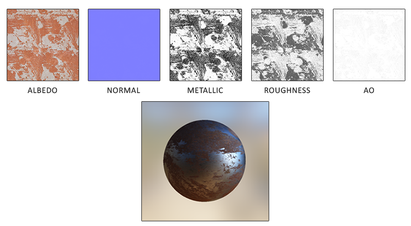

# Physically Based Shading

### 一、判断一种PBR光照模型是否是基于物理的，必须满足以下条件

1. 微平面模型：达到微观尺度之后，任何表面都是微平面
   - 粗糙，微平面排列混乱，光反射时更发散
   - 光滑，微平面平整，光反射时更趋同

2. 能量守恒：

   - 光进入物体表面后，分为反射光和折射光
   - 反射即为镜面反射；
   - 漫反射/次表面散射：光线**穿透**了材质的最表层，进入了被称为“次表面”的内部区域。在这里，光线与材质内部的微小粒子（分子、色素、晶体结构等）发生多次碰撞（散射），方向变得随机化。最终，部分光线被吸收（转化为热能），剩余部分从入射点附近的表面区域重新散射出来；
   - **漫反射** 是 **次表面散射的一种简化近似**，它假设光线在**极薄的次表面层**内被**完全随机化**后均匀射出。
   - **次表面散射** 是 **更广义的物理过程**，它描述了光线在**材质内部较深区域**中经历**多次散射与吸收**后，从**远离入射点的位置**射出的现象。

   | **特性**        | **漫反射 (Diffuse Reflection)**                | **次表面散射 (Subsurface Scattering)**             |
   | --------------- | ---------------------------------------------- | -------------------------------------------------- |
   | **物理本质**    | 次表面散射的**理想化近似模型**（如Lambertian） | **真实的物理过程**（光线在介质内传播、散射、吸收） |
   | **作用深度**    | **极薄表层**（≈微米级），光线在入射点附近射出  | **较深内部**（毫米至厘米级），光线从远处射出       |
   | **方向分布**    | 假设光线**完全随机化**，半球方向**均匀散射**   | 散射方向**非完全均匀**，可能保留部分方向性         |
   | **空间分布**    | 光线从**入射点附近**射出，颜色**均匀**         | 光线从**远离入射点**的位置射出，产生**颜色透射**   |
   | **视觉表现**    | 提供物体**固有色**（如石膏、粗糙塑料）         | 产生**透光感**（如皮肤红润、玉石温润、蜡烛发光）   |
   | **能量守恒**    | 遵循能量守恒（反射光≤入射光）                  | 需更复杂的体积传输模型（如扩散方程）               |
   | **常见材质**    | 纸张、石膏、未抛光木材                         | 皮肤、蜡、牛奶、大理石、树叶、葡萄                 |
   | **PBR实现模型** | Lambert, Oren-Nayar、Cook Torraince            | 扩散近似（Diffusion Approximation）, 随机游走模型  |

3. 基于物理的BRDF

### 二、PBR光照模型

1. Metallic Roughness 
   - 金属表面：折射光被直接吸收而不是散开，因此不考虑折射，只考虑反射；**因此只有镜面反射**，没有漫反射；
2. Specular Glossiness

### 三、辐射度量学

| 中文名           | 英文名            | 单位       | 符号   | 意义                         |
| ---------------- | ----------------- | ---------- | ------ | ---------------------------- |
| 辐射能量         | radiant energy    | J（焦耳）  | Q      | 能量                         |
| 辐射通量         | radiant flux      | W          | 欧米伽 | 功率                         |
| 辐射照度(辐照度) | irradiance        | W/m^2      | E      | 单位面积上的功率             |
| 辐射强度         | radiant intensity | W/sr       | I      | 单位立体角上的功率           |
| 辐射亮度(辐射率) | radiance          | W/(m^2*sr) | L      | 单位立体角、单位面积上的功率 |

辐射率/辐射亮度：

- **是光能在空间和方向上的“密度”，决定了我们看到的每一个像素的亮度**
- 单位时间内，通过单位面积（垂直于光线传播方向），在单位立体角内传播的辐射通量；
- **感知核心**：人眼/相机直接测量的是辐射率L，而非其他辐射量；
- **关键性质**：真空中，沿光线路径的辐射率 **L** 保持不变；

#### 四、渲染方程

1. 辐射率方程
   $$
   L(x,ω)= \frac{d^2Φ}{dA^⊥⋅dω}
   $$
   
   $$
   L(x,ω)= \frac{d^2Φ}{cosθ⋅dA⋅dω}
   $$

   - x：空间中的点（位置）
   - ω：光线方向（单位向量）
   - d^2Φ：通过微小区域的辐射通量（W）
   - dA⊥：垂直于光线方向的微小投影面积（m²）
   - dω：微小立体角（sr）
   - θ：光线与表面法线的夹角（若涉及表面）
   - dA：实际微小表面积（非投影面积）

2. 渲染方程

   辐射率是**渲染方程（Rendering Equation）** 的核心变量：
   $$
   L_o(x,ω_o)=L_e(x,ω_o)+∫_Ωfr(x,ω_i,ω_o)⋅L_i(x,ω_i)⋅cosθ_idω_i
   $$

   - Lo：从点 *x* 向方向 ωo**出射**的辐射率
   - Le：点 x自身发出的辐射率（光源）
   - fr：BRDF（材质反射属性），双向反射分布函数，基于表面材质属性，对入射辐射率进行缩放或者加权
   - Li：从方向 ωi**入射**到 x 的辐射率
   - cos⁡θ：入射角衰减因子
   - ωo :  出射方向（观察方向）
   - ωi ：入射方向（光源方向） 

3. BRDF 双向反射分布函数

   - 公式
     $$
     f_r=k_d⋅f_{lambert}+k_s⋅f_{cook−torrance}
     \\
     k_d+k_s = 1.0 \quad (能量守恒)
     \\
     f_{lambert} = \frac{c}{π}  \quad (Lambertian漫反射)
     \\
     f_{cook−torrance}=\frac{D⋅F⋅G}{4(ω_o⋅n)(ω_i⋅n)} \quad (cook−torrance镜面反射)
     $$

   - Cook-Torrance BRDF的镜面反射部分包含三个函数

     - D：Normal **D**istribution Function  法线分布函数：在受到粗糙度的影响下，法线朝向与半程向量一致的微平面的比率；
       $$
       D_{GGX}(n,h,α)=\frac{α2}{π((n⋅h)^2(α^2−1)+1)^2} \quad (a:粗糙度，h:半程向量)
       $$
       
     - F ：**F**resnel Rquation  菲涅尔方程：不同角度下光线反射部分与折射部分所占的比率；方程描述的是被反射的光线对比光线被折射的部分所占的比率，这个比率会随着我们观察的角度不同而不同。
       $$
       F_{Schlick}(h,v,F_0)=F_0+(1−F_0)(1−(n⋅v))^5
       \\
       F_0 : 基础反射率
       \\ 0度 = F0,低反射率(基础反射率)，显示材质本色
       \\ 90度 = 1.0，边缘掠射角，高反射率(靠近镜面反射效果)
       $$
       
     
       - 电解质与金属的基础反射率的分布范围不同,大多数电介质使用0.04作为F0,金属一般高于0.17；
     
       - 大多数渲染管线有0-1.0的金属度参数；
     
       - ##### 能量分配控制器: 菲涅尔效应直接决定**反射光与折射光的能量分配**：
     
         - **非金属**：
           - 反射光：F(v)
           
           - 漫反射：(1−F(v))×Albedo
           
         - **金属**：
           - 反射光：F(v)
           - **漫反射：0(光被自由电子吸收)**
       
     - G ：**G**eometry Function 几何函数：描述了**微平面自成阴影**的属性，表面比较粗糙时，微平面可能遮挡其他微平面，从而减少反射光线；
     
       
     
       - Schlick-GGX
         $$
         G_{SchlickGGX}(n,v,k)= \frac{ n⋅v}{(n⋅v)(1−k)+k} \quad(k是粗糙度a的重映射)
         \\
         k_{direct}=\frac{(α+1)^2}{8}
         \\
         k_{IBL}=\frac{α^2}{2}
         $$
         
       - Smith
         $$
         G_{smith}(n,v,l,k)=G_{SchlickGGX}(n,v,k)⋅G_{SchlickGGX}(n,l,k)
         \\
         (v 是观察方向，l 是光线方向)
         $$
         
       
     - 完整的渲染方程：
       $$
       L_o(p,ω_o)=∫_Ω(k_d \frac{c}{π}+k_s \frac{DFG}{4(ω_o⋅n)(ω_i⋅n)})L_i(p,ω_i)n⋅ω_idω_i 
       \\
       k_s = F_{Schlick}(h,v,F_0) \quad k_s直接由菲涅尔项计算得到
       \\
       k_d = 1.0 - k_s
       $$
       
     - 除了漫反射和镜面反射之外，PBR也是需要环境光的：
     
       ```glsl
       vec3 ambient = vec3(0.03) * albedo * ao;
       ```
     
     - UE4 中：D使用Trowbridge-Reitz GGX，F使用Fresnel-Schlick近似(Fresnel-Schlick Approximation)，而G使用Smith’s Schlick-GGX。

### 五、PBR 材质

​	PBR渲染管线所需要的每一个表面参数都可以用纹理定义和建模；使用纹理可以让我们逐片段地定义表面上特定的点是如何响应光线的；



- Albedo 反照率: 指定表面颜色或基础反射率；**入射光在材质表面被反射（而非吸收或透射）的能量比例**
  - 与Phong模型中的漫反射纹理类似，但不完全相同；Diffuse中可以包含比如细小阴影和裂纹信息（环境光遮蔽等虚假阴影），Albedo中只包含表面颜色（或者说折射吸收系数、基础反射率）；
- Normal：为表面制造出起伏不平的假象；
- Metallic：纹素是不是金属质地的；
- Roughness：粗糙度数值会影响一个表面的微平面统计学上的取向度；
- AO：为表面和周围潜在的几何图形指定了一个额外的阴影因子；反照率纹理上的砖块裂缝部分应该没有任何阴影信息，然而AO贴图则会把那些光线较难逃逸出来的暗色边缘指定出来。

### 六、光照

1. 光源类型对PBR的影响

   - 直接光源
     - 点光源：有恒定的辐射率（从哪个方向观察点光源，亮度一致），着色点的辐射率只在一个方向上非0，按照光源到着色点的距离进行衰减；
     - 定向光(directional light)：拥有恒定的方向而不会有衰减因子；
     - 聚光灯光源：没有恒定的辐射强度，其辐射强度是根据聚光灯的方向向量来缩放的；
     - 体积光源：着色点的辐射率会在不止一个方向上非0；（算哪边？）
   - 间接光源：IBL环境光照，需要对各个方向上的光线进行积分

2. 线性空间和HDR渲染

   - PBR着色计算在线性空间进行，这样所有输入更接近在物理上的取值，计算结果也有更大的变化空间

   - 色调映射：HDR-->LDR ,将线性空间高动态范围的颜色转换为显示设备可以支持的低动态范围；

     - ##### 常用Tone Mapping算法：

       - Reinhard:简单易过曝
         $$
         L_d = \frac{L}{1 + L}
         $$
         
  - ACES：S形曲线，保留高光细节
       $$
         L_d = \frac{L \cdot (2.51L + 0.03)}{L \cdot (2.43L + 0.59) + 0.14}
       $$
       
       - Uncharted 2: 风格化 ，复杂曲线拟合；

   - Gama矫正：LDR颜色需要适配人眼视觉感知，人眼对颜色的感受是非线性的曲线，对暗更敏感；

   ```mermaid
graph LR
   A[线性空间计算] --> B[输出HDR颜色] 
   B --> C[Tone Mapping] 
   C --> D[Gamma校正] 
   D --> E[显示设备]
   ```

   ```glsl
// 1. 线性空间PBR计算
   vec3 albedo = texture(albedoMap, uv).rgb;
   // albedo和AO贴图创作后在sRGB空间，需要转线性空间;
   // roughness和metallic贴图在线性空间，不需要转换;
   albedo = pow(albedo, vec3(2.2)); 
   
   vec3 radiance = calculatePBR(albedo, roughness, metallic); 
   
   // 2. 色调映射 (HDR -> LDR)
   vec3 toneMapped = ACESFilm(radiance); 
   
   // 3. Gamma校正 (线性 -> sRGB)
   vec3 finalColor = pow(toneMapped, vec3(1.0/2.2)); 
   
   // 输出到帧缓冲
   FragColor = vec4(finalColor, 1.0);
   ```

   

### 七、基于图像的光照IBL

1. 基于图像的光照（Image Based Lighting）:将周围环境整体视为一个大光源；

### 八、漫反射辐照度


