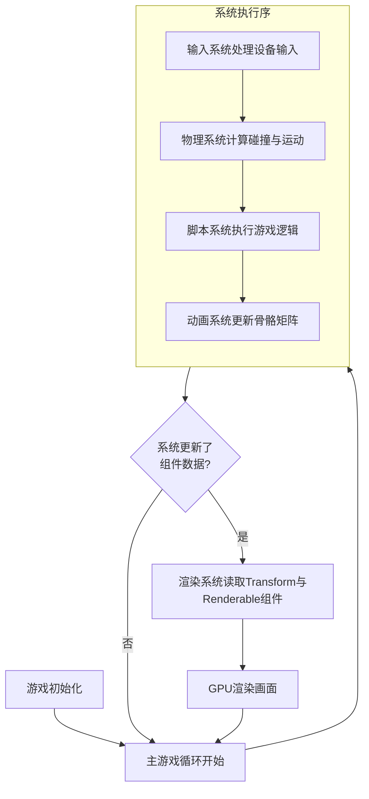

# ECS架构

1. 概述

   - ECS(Entity-Component-System 实体-组件-系统)，遵循组合优于继承原则；

   - 每一个基本单元都是一个实体，每个实体由一个或多个组件构成，每个组件仅包含代表其特性的数据；

   - 实体与组件是一对多的关系，可以动态的增加或者删除组件；

   - **系统**用于处理相同组件的数据；

   - **核心优势**：解耦、灵活性、高性能（缓存友好性）。

     

     

2. **Entity（实体）**：只是一个唯一的 ID。它本身没有任何功能或数据，**只是一个标识符**，用于将 Component 聚合在一起。例如，`Entity #123` 可以代表游戏中的一棵树或一个角色。

3. **Component（组件）**：纯数据。没有逻辑。它们是附加到 Entity 上的属性包。例如，`TransformComponent`（位置、旋转、缩放）、`HealthComponent`（生命值）、`RenderableComponent`（网格、材质）等。

   - 是数据的集合，没有方法，只有数据用于存储状态；
   - 经典的实现方法是：所有组件继承自一个共同的基类；
   - 单例组件：整个世界中有且只有一个实体拥有组件；例如：输入组件；

4. **System（系统）**：纯逻辑。没有状态。System 持续运行，并负责处理拥有特定 Component 组合的 Entity。例如，`RenderingSystem` 会遍历所有拥有 `TransformComponent` 和 `RenderableComponent` 的 Entity，并将它们渲染到屏幕上。

   - 系统是处理游戏逻辑的部分，一个系统就是对组件进行操作的工具，只有行为没有状态；
   - UtilityFunction(实用函数)：多个系统需要运行同一个逻辑，将该公用的逻辑放在UtilityFunction中；

5. https://zhuanlan.zhihu.com/p/106946506   未读完

非常好！这是一个关于游戏引擎架构的核心问题。ECS（Entity-Component-System）架构是一种强大的设计模式，它彻底改变了游戏对象的构建和逻辑处理方式。

### 核心思想回顾

*   **Entity (实体)**：一个空的、唯一的标识符（通常是一个ID）。它本身什么都没有，只是作为组件的容器。例如，游戏中的玩家、敌人、子弹都可以是一个实体。
*   **Component (组件)**：纯数据。它代表实体的某一方面属性或特征，但没有任何行为逻辑。例如：位置、速度、外观、生命值。
*   **System (系统)**：纯逻辑。它负责处理所有拥有特定组件组合的实体，实现游戏行为。例如：移动系统处理所有拥有`位置`和`速度`组件的实体。

---

### 一、常见的组件 (Components)

组件是数据的集合。以下是一些在几乎所有游戏中都会出现的通用组件：

1.  **Transform (变换组件)**
    *   **数据**：位置 (`vec3`)、旋转 (`quaternion`)、缩放 (`vec3`)。
    *   **作用**：定义实体在游戏世界中的空间信息。**几乎每个可见或可交互的实体都有此组件。**

2.  **Renderable / Mesh (渲染组件)**
    *   **数据**：网格数据（顶点、索引）、材质引用、纹理引用。
    *   **作用**：定义实体的视觉表现。拥有此组件的实体才会被渲染系统绘制到屏幕上。

3.  **Physics / RigidBody (物理组件)**
    *   **数据**：质量、速度、角速度、碰撞形状、是否受重力影响、阻力等。
    *   **作用**：定义实体的物理属性，供物理系统进行模拟。

4.  **Camera (相机组件)**
    *   **数据**：投影类型（透视/正交）、视野(FOV)、近裁剪面、远裁剪面。
    *   **作用**：定义游戏场景的一个观察视角。渲染系统会使用激活的相机组件来渲染场景。

5.  **Light (光源组件)**
    *   **数据**：灯光类型（平行光、点光源、聚光灯）、颜色、强度、衰减范围。
    *   **作用**：定义场景中的一个光源，影响渲染系统对周围物体的光照计算。

6.  **Script (脚本组件)**
    *   **数据**：指向一段特定游戏逻辑脚本（如Lua、C#脚本）的引用或标识符。
    *   **作用**：允许为实体附加自定义的、非引擎内置的行为逻辑。

7.  **Health (生命值组件)**
    *   **数据**：当前生命值、最大生命值。
    *   **作用**：标记一个实体可以被伤害和治疗，并记录其生命状态。

8.  **Tag (标签组件)**
    *   **数据**：一个简单的标签（如字符串"Player", "Enemy", "Collectible"）。
    *   **作用**：用于快速标记和查询实体，通常不包含复杂数据。

9.  **State (状态组件)**
    *   **数据**：当前状态枚举（如`IDLE`, `WALKING`, `JUMPING`, `ATTACKING`）。
    *   **作用**：管理实体的状态，状态机系统可以根据此组件来驱动状态转换和动画。

---

### 二、常见的系统 (Systems)

系统是行为的实现。每个系统都在每一帧（或特定时间间隔）自动运行，寻找并处理所有拥有其所需组件的实体。

1.  **Transform System (变换系统)**
    *   **处理组件**：`Transform`（常处理父子层级关系）。
    *   **职责**：计算和更新世界变换矩阵。如果实体有父级，它会将本地变换与父级的世界变换相结合。

2.  **Rendering System (渲染系统)**
    *   **处理组件**：`Transform` + `Renderable` + (可选)`Light`。
    *   **职责**：收集所有可渲染实体，根据它们的变换和网格数据，执行剔除、排序、提交渲染命令给图形API（如Vulkan、DirectX）。这是最核心的系统之一。

3.  **Physics System (物理系统)**
    *   **处理组件**：`Transform` + `Physics`。
    *   **职责**：模拟牛顿力学。计算碰撞检测与响应，更新实体的速度、角速度，并最终将物理模拟的结果（新的位置和旋转）写回`Transform`组件。

4.  **Camera System (相机系统)**
    *   **处理组件**：`Transform` + `Camera`。
    *   **职责**：根据相机组件的数据和其所属实体的变换，计算视图矩阵和投影矩阵，并将其提供给渲染系统。

5.  **Input Handling System (输入处理系统)**
    *   **处理组件**：通常不直接关联特定组件，但会影响带有`Script`或`Controller`组件的实体。
    *   **职责**：轮询操作系统或平台的输入设备（键盘、鼠标、手柄），将输入事件转换为游戏内的操作命令，并分发给感兴趣的实体或脚本。

6.  **AI System (人工智能系统)**
    *   **处理组件**：`Transform` + `AI`（可能包含目标、行为树等数据）。
    *   **职责**：执行AI逻辑，如寻路、决策、感知。它会更新AI组件的状态，并可能修改实体的`Transform`或`Physics`组件（如设置一个移动方向）。

7.  **Animation System (动画系统)**
    *   **处理组件**：`Renderable` (Skinned Mesh) + `Animator`。
    *   **职责**：根据动画状态和剪辑，计算骨骼动画中每一根骨骼的当前变换，并将结果写入蒙皮网格的着色器常量中。

8.  **Script System (脚本系统)**
    *   **处理组件**：`Script`。
    *   **职责**：实例化脚本，并在每帧调用脚本的更新方法（如`Update()`），让游戏逻辑得以运行。

---

### 三、二者如何协同运行？

ECS架构的协同运行就像一个高度专业化的工厂流水线，其核心是 **“数据驱动”** 和 **“关注点分离”**。协同流程可以概括为下图所示的清晰循环：

**1. 数据驱动 (Data-Driven)**
*   系统**不关心**实体是“玩家”还是“敌人”，它只关心实体是否拥有它需要的**数据**（组件）。
*   例如，**物理系统**只寻找所有拥有 `Physics` 和 `Transform` 组件的实体。它读取它们的物理数据（速度、质量），进行计算，然后将结果（新的位置、旋转）**直接写回** `Transform` 组件。它完全不知道这个实体是被玩家控制还是由AI控制。

**2. 关注点分离 (Separation of Concerns)**
*   每个系统只负责一件事，并且把它做好。
*   **物理系统**只负责物理模拟，它计算出一个应该发生碰撞的反应力。它**不会**直接去减少实体的生命值。它可能会生成一个 `CollisionEvent`（碰撞事件）数据组件，然后由另一个 **“伤害系统”** 来专门处理这个事件，检查发生碰撞的两个实体是否有 `Health` 组件，然后再执行扣血逻辑。

**3. 执行顺序 (Execution Order)**
*   系统的运行顺序至关重要，并且通常由引擎开发者严格定义。
*   **经典顺序**：
    1.  **输入系统** 最先运行，获取本帧的玩家输入。
    2.  **脚本系统** 随后运行，处理游戏逻辑，可能会根据输入修改实体的速度或状态。
    3.  **物理系统** 开始模拟，基于当前速度等数据更新位置。**物理系统必须在渲染系统之前运行**，这样物体才能被渲染到正确的位置上。
    4.  **动画系统** 更新骨骼动画。
    5.  **渲染系统** 最后运行，将所有状态已确定的实体绘制到屏幕上。

这种协同方式的巨大优势在于：
*   **性能**：数据被连续存储（数组化），系统可以高效地遍历组件，极大利用CPU缓存。
*   **灵活性**：通过添加和移除组件来改变实体行为非常简单，无需复杂的继承 hierarchy。
*   **可预测性**：清晰的数据流和职责划分，使得代码更易于调试和维护。
*   **并行化**：不同的系统通常可以并行执行（例如，AI系统和粒子系统），只要它们不修改相同的组件数据。