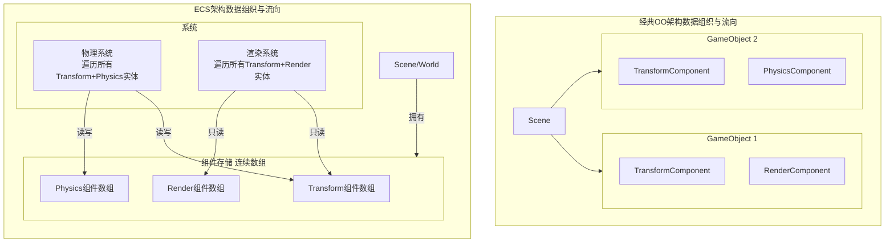

这是一个非常棒的、切中要害的问题，它触及了游戏引擎架构设计的核心权衡。你描述的模式是经典的**面向对象（Object-Oriented, OO）继承驱动架构**，与**数据导向的ECS架构**有着根本性的区别。

我们来详细对比一下这两种思路的优劣。

### 你描述的经典OO架构：自上而下的更新链

```
MainLoop -> Scene.Update() -> for each GameObject: GameObject.Update() -> for each Component: Component.Update()
```

**核心特征：**
*   **以“对象”为中心**：`GameObject` (或 `Entity`) 是一个包含了组件列表和方法的“全能”对象。
*   **控制流内聚**：更新逻辑由对象自身驱动。每个 `GameObject` 的 `Update` 方法负责调用其所有组件的 `Update`。
*   **层级化管理**：`Scene` 管理所有 `GameObject`, `GameObject` 管理其 `Component`。

---

### 与ECS架构的对比

为了让二者的核心差异更加直观，我们可以从以下几个维度进行对比：

| 特性维度       | 经典OO架构 (MainLoop->Scene->Object->Component)              | ECS架构 (Entity-Component-System)                            |
| :------------- | :----------------------------------------------------------- | :----------------------------------------------------------- |
| **设计哲学**   | **封装与继承**：强调整体对象，逻辑内聚在对象内部。           | **组合与分离**：强调数据与逻辑分离，对象是组件的集合。       |
| **数据组织**   | **分散存储**：每个`GameObject`及其`Component`在内存中通常是**独立分配**的。遍历时是在指针链上跳转。 | **连续存储**：同类组件被**连续存储**在数组中以实现**SoA**。例如，所有`VelocityComponent`在一个数组里。 |
| **缓存友好度** | **差**：指针追逐导致大量的**缓存未命中（Cache Miss）**。CPU需要频繁从主内存拉取数据，效率低下。 | **极佳**：系统对连续数组进行线性遍历，**缓存预取**效率极高，非常适合CPU的流水线工作。 |
| **性能**       | 相对较低，尤其在处理大量实体时，CPU瓶颈会非常明显。          | **极高**。数据局部性带来了巨大的性能提升，易于并行化。       |
| **灵活性**     | 尚可，通过组件模式提供了一定灵活性。但行为仍依赖于对象的继承层级。 | **极高**。通过动态添加/移除组件来改变实体行为，真正做到“组合优于继承”。 |
| **逻辑复用**   | 逻辑分布在各个组件的`Update`方法中，容易产生重复代码。       | 系统是纯粹的逻辑块，高度可复用。任何一个新实体只要拥有所需组件，就能被相应系统处理。 |
| **并行化**     | **困难**。对象间的更新可能存在隐式依赖，更新顺序固定（如Transform必须在Render之前），难以拆分到多线程。 | **天然适合**。不同的**System**可以轻松地在不同的**CPU核心**上并行运行，只要它们不访问相同的组件数据。 |
| **复杂度**     | **认知简单**：符合直觉，易于初学者理解和上手。               | **认知复杂**：需要转变思维模式，理解数据与逻辑的分离，对架构设计能力要求更高。 |
| **典型代表**   | 早期版本的Unity（虽然现在支持ECS）、许多自研的中小型引擎。   | **Unity DOTS**、**Bevy**（Rust）、**Filament**（渲染器，非纯粹ECS但吸收其思想）。 |

为了更直观地理解两种架构在**数据组织**和**控制流**上的根本差异，我们可以参考以下图示：



---

### 结论与优劣总结

**经典OO架构的优势：**
1.  **易于理解和上手**：符合人们对“物体”的直观认知，设计流程自然。
2.  **原型开发速度快**：对于小型项目或原型，可以非常快速地搭建出功能。
3.  **封装性良好**：对象内部逻辑自洽，对于独立功能模块的管理很方便。

**其劣势（正是ECS要解决的）：**
1.  **性能瓶颈**：**糟糕的数据局部性**是其主要性能杀手，无法充分利用现代CPU的缓存架构。
2.  **难以优化**：当需要针对某一功能（如物理模拟）进行全局优化时，需要在无数个分散的`Component.Update`中寻找逻辑，非常困难。
3.  **僵化的继承结构**：容易导致复杂的继承树，使得代码僵化，难以维护和扩展。

**ECS架构的优势：**
1.  **极致性能**：**缓存友好性**和**并行化能力**是其最大优势，特别适合需要处理海量实体（成千上万）的游戏，如RTS、模拟城市、大规模战斗场景。
2.  **高度的灵活性和可组合性**：轻松创建各种新奇的对象类型，而无需修改现有代码。
3.  **清晰的关注点分离**：系统职责单一，代码更易于维护、测试和调试。

**其劣势：**
1.  **学习曲线陡峭**：需要开发者彻底转变思维模式，从“对象是什么”变为“对象有什么数据以及如何处理”。
2.  **架构复杂度**：需要精心设计组件和系统，管理好系统间的执行顺序和依赖关系。
3.  **过度工程**：对于非常小型的项目，使用ECS可能显得“杀鸡用牛刀”，增加了不必要的复杂性。

**现代引擎的趋势是融合**：像Unity这样的引擎，其传统模式就是你描述的OO架构，但其高性能模式（DOTS）则是彻底的ECS。许多引擎也在吸收ECS的思想，比如提供更高效的数据访问方式。选择哪种架构，最终取决于你的项目规模、性能要求和发展预期。