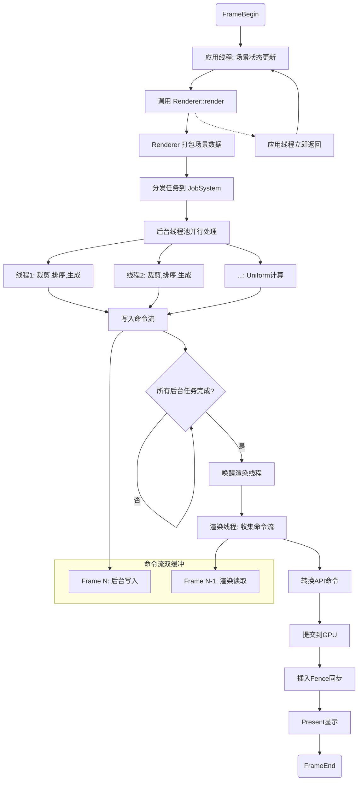

### 异步渲染架构

**核心思想**：将准备渲染命令（CPU）与执行渲染命令（GPU）解耦，并充分利用多核CPU进行并行化的命令准备；

#### 生产者-消费者

1. 生产者：多个后台线程，并行处理场景数据，为每个可渲染对象生成对应的GPU渲染指令；
2. 消费者：渲染线程，负责收集所有后台线程生成好的命令，并以一个非常高效的方式提交给GPU；
3. 双缓冲命令队列：一个缓冲用于后台命令线程写入生成的渲染命令，另一个缓冲用于渲染线程读取渲染命令；渲染的双缓冲帧，每帧有一个命令队列；

#### 框架结构

```txt
┌─────────────────────────────────────────────────────────────────┐
│                    Filament 多线程渲染架构                       │
├─────────────────┬─────────────────┬─────────────────────────────┤
│   应用线程        │   后台线程池     │       渲染线程               │
│  (主线程)        │  (JobSystem)    │     (专用线程)              │
├─────────────────┼─────────────────┼─────────────────────────────┤
│ • 场景状态更新    │ • 视锥裁剪      │ • 等待后台任务完成           │
│ • 物体变换       │ • 渲染排序      │ • 收集命令流                │
│ • 材质更新       │ • 命令生成      │ • 提交GPU命令               │
│ • 调用render()  │ • Uniform计算  │ • 资源绑定                 │
│                 │ • 写入命令流    │ • 状态管理                 │
│                 │                 │ • Present调用             │
└─────────────────┴─────────────────┴─────────────────────────────┘
         │                   │                    │
         ▼                   ▼                    ▼
┌─────────────────────────────────────────────────────────────────┐
│                   核心数据结构和缓冲区                           │
├─────────────────┬─────────────────┬─────────────────────────────┤
│   场景数据       │   命令流         │   统一变量缓冲区             │
│  (SOA结构)      │  (双缓冲)        │   (Uniform Ring Buffer)   │
│                 │                 │                            │
│ • 不可变数据     │ • Frame N-1:    │ • 环形内存池                │
│ • 组件化设计     │   渲染线程读取    │ • 多线程安全写入            │
│ • 无锁访问       │ • Frame N:      │ • 偏移量引用               │
│                 │   后台线程写入    │                            │
└─────────────────┴─────────────────┴─────────────────────────────┘
         │                   │                    │
         ▼                   ▼                    ▼
┌─────────────────────────────────────────────────────────────────┐
│                     渲染后端抽象层                               │
├─────────────────┬─────────────────┬─────────────────────────────┤
│   Vulkan后端     │   OpenGL后端    │     Metal后端               │
│                 │                 │                            │
│ • vkCmd*        │ • glDraw*       │ • MTLCommandBuffer        │
│ • Pipeline状态  │ • 状态机管理     │ • 编码器管理                │
│ • 描述符集       │                 │                            │
└─────────────────┴─────────────────┴─────────────────────────────┘
```


#### 渲染流程

1. 应用主线程（逻辑线程）

   - 更新场景状态：处理逻辑（输入、动画、移动等），更新场景中所有对象的transform、材质参数等；
   - 调用render():将当前view提交给渲染器，当前帧结束，不等待渲染，立刻进行下一帧的逻辑更新；

2. 并行命令生成（Job System）

   - render将场景数据分发到Job System，Job System将场景数据分割交给多个后台命令线程；

   - 每个命令线程并行处理一批渲染对象（Renderables）

     - 视锥体裁剪（即视锥体剔除）：判断物体是否可见；

     - 排序：根据材质、着色器状态、深度等信息对可见物体进行排序，作用如下：

       - 减少API调用：相同状态的物体批量渲染；
       - 正确渲染：透明物体从后往前排序；
       - 优化性能：减少GPU状态切换开销（着色器、纹理、渲染状态等的切换）；

       ```c++
       // Filament中的排序类型
       enum class SortingStrategy {
           BY_SHADER,        // 按着色器排序 - 减少着色器、管线切换  
           BY_TEXTURE,       // 按纹理排序 - 减少纹理绑定
           BY_DEPTH,         // 按深度排序 - 透明物体需要
           BY_PRORITY,       // 按渲染优先级排序 - UI > 透明 > 不透明
           BY_RENDER_MODE,          // 按渲染状态排序 - 减少深度测试、模板测试等的切换
       };
       ```

       

   - 生成命令

     - 对于每个通过裁剪、剔除的对象，为其生成一个或多个Command；
     - Command是轻量级对象，不包含顶点、索引等原始数据，只包含句柄（缓冲区句柄、纹理句柄、着色器程序句柄等），以及材质参数、Uniform数据、GPU状态（深度、模板）等；
     - 将生成的Command写入本地的命令队列（命令线程的命令队列由渲染线程创建，借给各命令线程使用，后续由渲染线程合并各命令线程的命令队列）

3. 命令提交（渲染线程）

   - 收集与提交
     - 所有命令线程完成命令生成后，唤醒渲染线程
     - 渲染线程获取填充完毕的命令队列
     - 渲染线程遍历命令队列，翻译为图形绘制API，并调用
     - 优化：可以合并连续的、状态相同的绘制调用
   - 上屏：渲染线程调用swapBuffer将渲染好的图像显示到屏幕；

4. 同步

   - GPU-CPU同步：渲染线程向GPU提交完一帧的绘制指令后，插入一个Fence，用于防止CPU工作过于超前；
   - 双缓冲：命令队列、统一变量缓冲区等都采用双缓冲策略，确保生产者消费者永远不会竞争同一块内存，实现高效异步；

#### 	流程图




#### 时序图

```txt
时间轴:    Frame N-1          Frame N           Frame N+1
         ──────────────────────────────────────────────────
应用线程:  [逻辑更新N] ──────> [逻辑更新N+1] ─────> [逻辑更新N+2]
          │                   │                   │
          ▼                   ▼                   ▼
渲染提交:  [render(N)]        [render(N+1)]       [render(N+2)]
                    │                   │
                    ▼                   ▼
后台线程:           [处理N]              [处理N+1]
                            │                   │
                            ▼                   ▼
渲染线程:                    [提交N]              [提交N+1]
                                    │                   │
                                    ▼                   ▼
GPU执行:                            [GPU执行N]          [GPU执行N+1]
```


#### 关键技术

1. JobSystem
2. 双缓冲命令队列 CommandStream
3. 统一变量环形缓冲区(Uniform Ring Buffer)：
   - 环形内存池
   - 多线程安全写入
   - 偏移量引用
4. 后端BackEnd
5. Fence 
6. 内存屏障


