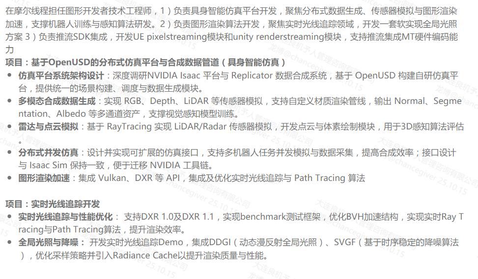
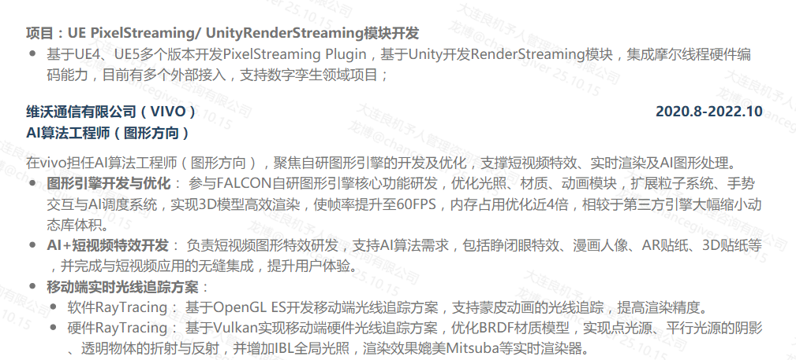

#### 虹宇

1. 纯自研引擎
   - 异步渲染架构
     - 多进程
     - 多线程
   - Frame Graph
   - Job System 
   - ECS
   - 动画模块：过渡、混合、状态机、混合树
   - 阴影
2. 交互
   - 多模态跨进程交互框架
   - 事件架构
3. 渲染效果及优化
   - 渲染效果
   - ATW、ASW、注视点渲染
4. 预研项目：
   - 光线追踪渲染器
     - opengl软光线追踪渲染器
     - vulkan光线追踪渲染器
   - 高斯泼溅

#### 小红书Zeus引擎开发

1. Zeus引擎
2. 视频特效

#### 相芯

1. 自研引擎
2. 人物真实感渲染
3. 人物骨骼蒙皮动画、变形动画

#### 拓展技术

1. 引擎架构：ECS、异步渲染框架
2. 延迟渲染、Forward+渲染、瓦片渲染
3. 阴影
4. PBR\BRDF\BSDF
5. 性能优化：视锥体剔除、遮挡剔除、静态合批、动态合批、Instancing
6. Nanite

## 简历参考

